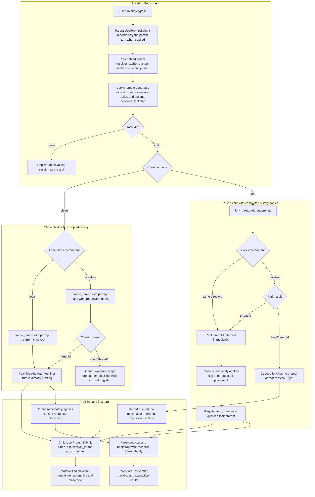

# Task Creation Flow

## Overview

This flow explains how `$agtask` designates the current task or creates one
child task. It distinguishes a clean child from a fork, and a regular
same-checkout child from a child whose Git worktree must be materialized before
its real Codex session ID exists.

## Entry Points

The flow starts when a user invokes `$agtask`. If the parent task is already
tracked, its own `UserPromptSubmit` hook records that invocation as a parent
rollout; it does not create the child row.

- `skills/agtask/references/create.md:Select designation or creation`
- `skills/agtask/scripts/agtask:command_resolve_create`
- `skills/agtask/scripts/agtask:handle_hook`

## Sequence Diagram



## Execution Trace

### 1. Resolve one creation attempt

The parent resolves task kind, clean-or-fork mode, environment, title, model,
pin policy, project, inherited sidebar section, and one logical creation ID
before calling a Codex task tool. That ID is reused for every registration and
bootstrap write in this attempt.

For pin-enabled creation, `section-cache get --session-id <source-session-id>
--json` first checks the invoking tracked main or applicable root main; a
tracked child's own observed custom section takes precedence. A fresh hit
avoids sidebar enumeration. A missing or stale entry triggers one
`list_threads` call and an exact `sections[].itemKeys` match using
`codex:thread:local:<session-id>` or
`codex:thread:remote:<session-id>`. Store the verified custom section or
default `pinned` destination using `section-cache set`; unavailable discovery
uses `pinned` without caching an unverified observation. `nopin` skips the
lookup, cache access, and placement entirely.

#### 1.1 Generate the logical ID, child trailer, and optional clean plan

- `skills/agtask/scripts/agtask:command_resolve_create`

```ts
resolved := merge_defaults_and_explicit_inputs()
creation_id := uuid_v4()
if resolved.kind == "child"
  trailer := canonical_v2_trailer(creation_id, section_id_when_pinning)
if resolved.kind == "child" and resolved.mode == "clean" and task_text exists
  prompt := task_text + configured_on_create + trailer
  plan := create_thread(prompt, saved_project_id, resolved.environment)
return resolved + creation_id + trailer + optional(plan)
```

For `kind=main`, the resolver ID identifies the current task's ledger row, but
the child-only environment, model, and bootstrap values are inert.

### 2. Create the default clean child

The default path calls `create_thread` with the complete prompt. A regular
creation passes the local environment and runs in the current checkout. A
worktree creation passes the worktree environment and asks Codex to prepare an
isolated Git checkout for the child.

#### 2.1 Submit the clean prompt

- `skills/agtask/references/create.md:Fast path`

```ts
result := create_thread(
  prompt=clean_prompt_with_final_v2_trailer,
  target.environment=resolved.environment,
  model=resolved.model_when_explicit,
)
if result.threadId exists
  session_id := result.threadId
  set_thread_title(session_id, resolved.title)
  if resolved.pin
    move_to_resolved_section_or_use_legacy_pin(session_id)
else
  report queued clientThreadId
```

On the current Codex surface, clean creation is one-shot: `prompt` is required,
so the first child turn may start before the parent receives `threadId`.

### 3. Bind the child when its first prompt runs

The real child's `UserPromptSubmit` hook receives the final bootstrap trailer
and the real Codex `session_id`. It inserts or verifies the logical
`id -> session_id` pair and records the first user rollout in one transaction.

#### 3.1 Register from the real child hook

- `skills/agtask/scripts/agtask:handle_hook`

```ts
begin_immediate()
if id and session_id are unclaimed
  insert_thread(id, session_id, parent_session_id, status="active")
else if stored_pair != requested_pair
  rollback_and_emit_nothing()
record_real_user_turn(thread_id=id)
commit()
```

A clean worktree operation that initially returns only `clientThreadId` still
owns the submitted prompt. When Codex materializes that child and submits its
first turn, this hook can self-register it without parent polling.

### 4. Reconcile from the parent

When clean creation returns a real `threadId`, the parent first applies the
resolved title and requested sidebar placement, independently of hook or
backend availability. It then registers the same pair and records the
byte-identical prompt with reserved turn ID `bootstrap`. These writes repair
either parent-first or hook-first timing without creating a second row or
initial user rollout.

#### 4.1 Verify the returned child

- `skills/agtask/references/create.md:Verify write results`

```ts
register(
  id=creation_id,
  session_id=threadId,
  initial_prompt=prompt,
  authoritative_session=true,
)
record_turn(thread_id=creation_id, role="user", turn_id="bootstrap", content=prompt)
require one thread row and one initial user rollout
return codex_deep_link(threadId)
```

The parent does not wait for child-owned title and placement backup actions.
For every local or remote child with a real Codex session ID, parent-side
actions happen before either ledger request. Thus a missing hook, failed
first-turn recording, unavailable backend, or authoritative rebound cannot
prevent an already-created child from receiving its title and requested
placement.

Each placement first uses `move_thread_to_sidebar_section({threadId,
sectionId})` when available. Only when that tool is unavailable does it use
`set_thread_pinned({threadId, pinned: true})`; the legacy path reports
degradation when a custom section was requested. Never also globally pin after
a successful custom-section move.

## Notes

### Creation path comparison

| Path | Codex operation | Conversation context | Checkout | Prompt timing | Initial ledger behavior |
| --- | --- | --- | --- | --- | --- |
| Main designation | No create or fork call | Current task remains current | Current checkout | No child prompt | Register current session `active` with null parent |
| Regular clean child | `create_thread(prompt, local)` | New task; no copied history | Current checkout | Prompt is part of creation | Child hook may bind first; parent reconciles when `threadId` returns |
| Clean worktree child | `create_thread(prompt, worktree)` | New task; no copied history | New Codex-managed Git worktree | Prompt is attached before worktree materialization | A real `threadId` follows immediately or `clientThreadId` reports queued; queued child can self-register from the attached prompt |
| Same-directory fork | `fork_thread(same-directory)`, then `send_message_to_thread` | Copies completed parent history | Current checkout | Prompt is sent only after fork returns `threadId` | Parent registers `todo` before sending; child hook activates it |
| Worktree fork | `fork_thread(worktree)`, then message only after `threadId` exists | Copies completed parent history | New Codex-managed Git worktree | `fork_thread` carries no prompt | A queued `clientThreadId` is not registerable or messageable; the current agtask flow reports queued and stops before registration |

### Clean child versus fork

- Clean creation starts a new conversation. The child sees only its task prompt,
  configured `OnCreate` instruction, bootstrap trailer, and repository context.
- Forking copies completed conversation history from the source task. An active
  unfinished turn is not copied.
- The fork prompt begins with a guard stating that the new task is the sole
  current instruction and copied history is background.
- `create_thread` requires the prompt, so clean creation is hook-first capable.
  `fork_thread` accepts no prompt, so a real same-directory fork can be
  registered `todo` before `send_message_to_thread` starts its first new turn.

### Regular checkout versus worktree

- `worktree=false` selects `local` for clean creation and `same-directory` for
  fork creation. Both reuse the source checkout.
- `worktree=true` asks Codex to create a separate Git worktree. Setup may be
  asynchronous and return `clientThreadId` before the child has a real
  `threadId`.
- `clientThreadId` is never stored as `thread.session_id`, used in a Codex deep
  link, or passed to agtask registration.
- A queued clean worktree has already received its prompt and can self-register
  when materialized. A queued worktree fork has not received a prompt, so it
  cannot use bootstrap self-registration at that point.

### Identity and ordering constraints

- Child registration uses the invoking Codex session as immutable
  `parent_session_id`; the parent need not itself be tracked.
- The hook remains first-writer-wins because it cannot distinguish the primary
  child from a copied internal title-generation prompt.
- One-shot parent registration uses `--authoritative-session`, treating the
  `create_thread` result as canonical. When a copied helper bound the logical
  ID first, the CLI verifies the provisional row shape, rebinds the logical ID,
  removes copied helper rollouts, and reports `session_rebound_from`.
- Ordinary registration and hook conflicts remain strict; titles, timing, and
  UUID ordering are never used to choose the canonical session.

### Sidebar cache ownership and recovery

- The nonauthoritative cache is `sidebar-sections.json` beside the resolved
  ledger; `AGTASK_DB` moves both together without changing the SQLite schema.
- Entries are keyed by stable source session ID and record host, stable section
  ID, optional display name, and observation time. They expire after five
  minutes; unrelated session entries remain independent.
- Missing custom-section errors invalidate only the source-session entry,
  perform one refreshed `list_threads` lookup, and allow one placement retry.
- A parent with only the legacy pin tool still resolves and embeds a custom
  section because the newly created child may receive the section-move tool.

### Parent-owned title and sidebar placement

- Every local or remote child with a real Codex session ID (`threadId` in the
  creation result) receives its parent-applied title and requested sidebar
  placement before ledger registration or first-turn recording.
- The version-2 child actions remain enabled as an idempotent backup. The
  child may repeat the same section move and title safely. Legacy global
  pinning remains an availability fallback.
- A queued `clientThreadId` or worktree ID is not a Codex session ID, so the
  parent cannot target either app action. A queued clean child retains those
  actions in its submitted prompt; a queued fork has no submitted prompt yet.

## Observability

Metrics:
- None identified.

Logs:
- Parent orchestration reports `created; tracking pending`, verified, partial,
  or queued state. For every local or remote child with a real session ID, it
  also reports the direct parent result for title and sidebar placement.
- Explicit registration errors are printed by the agtask CLI. Hook-side
  malformed or conflicting bootstraps intentionally remain silent.

## Related docs

- [Session identity binding](session-identity-binding.md)
- [Flow index](README.md)
- [Architecture](../ARCHITECTURE.md)
- [Data model](../data_model.md)
- [CLI reference](../CLI.md)

## Manual Notes

[keep this for the user to add notes. do not change between edits]

## Changelog
- 2026-08-19: Apply parent-owned title and placement to every real child before ledger bookkeeping; retain child actions as an idempotent backup.
- 2026-08-06: Added cached main-section discovery, inherited child placement, section-move-first compatibility, and bounded missing-section recovery.
- 2026-07-21 10:21: Added remote-host title and pin fallback while preserving child-owned actions and queued-client behavior (019f6e7b-6fee-7b22-9ee7-0448a1431036 - b026a6e)
- 2026-07-21 10:07: Split task creation into a dedicated flow and distinguished regular clean, clean worktree, same-directory fork, and worktree-fork behavior (019f6e7b-6fee-7b22-9ee7-0448a1431036 - d0ab5633f6fc478e631614a90bf4c7e2054faafa)
