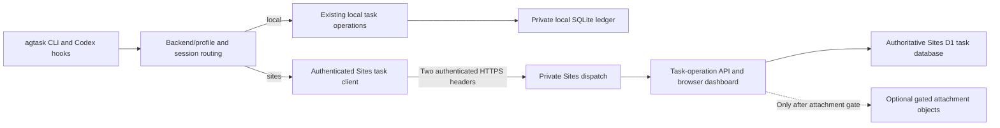

# Feature Design: Authoritative Local and Sites Task Backends

**Date:** 2026-08-06
**Status:** Draft; no implementation authorized by this document
**Owner:** agtask CLI, lifecycle hooks, and hosted Sites application

## Goal

Add the global option `agtask --mode <local|sites>`. `local` remains the default
and preserves the existing SQLite ledger and loopback dashboard exactly;
`sites` uses a private ChatGPT Site and its D1 database as the authoritative
backend for tasks, lifecycle events, search, and the hosted dashboard.

## Scope

In scope:

- Global backend selection that does not conflict with existing task-creation
  mode or change no-flag/local behavior.
- Independent local and Sites task authorities; neither mode silently reads or
  writes the other's task database.
- A versioned authenticated task-operation API, hosted D1 schema, remote
  lifecycle invariants, durable hook routing, and hosted dashboard.
- Credential ownership, concurrent mutations, retries, recovery, Sites
  capability proof, optional migration, and phased attachment support.

Out of scope:

- Removing the existing local CLI, local SQLite schema, or loopback dashboard.
- A read-only Sites mirror, one-way snapshot publisher, shared local/D1 writes,
  or automatic task migration.
- An external Sites deployment-management API, public Site access, direct
  arbitrary D1 SQL over HTTP, or guaranteed platform backup/restore.
- Copying local absolute paths, Codex conversation transcripts, credentials,
  private keys, or the enclosing shared Git history into a Site.

## Current State

The stdlib Python executable
[owns parsing, SQLite access, lifecycle actions, and the loopback dashboard](../../skills/agtask/scripts/agtask).
[The data model](../data_model.md) currently defines local schema version 8,
task/rollout/attachment/view/merge-claim ownership, FTS5 synchronization,
transactional lifecycle transitions, and exact JSON result contracts.

- `resolve-create --mode {clean,fork}` already controls conversation creation;
  `.agtask.json` `defaults.mode` has the same existing meaning.
- Installed Codex handlers invoke bare `agtask hook` in separate processes with
  a five-second timeout; a one-off CLI flag cannot modify their environment.
- Parent creation performs several separate `resolve-create`, `register`, and
  `record-turn` invocations. Hook-first bootstrap registration and its initial
  user rollout currently commit in one local transaction.
- `show`, `list`, `search`, `rename`, `audit`, status/reopen, merge-fenced
  close, dashboard mutations, attachments, and user/assistant/meta rollouts
  assume local SQLite across many command-specific transaction owners.
- [The deployed synthetic Sites probe](../CODEX_SITE_AUTH_PROBE.md) verified
  private owner-only machine ingress, independent application authorization,
  D1 persistence, and page updates without redeployment. The Worker saw no
  human identity and did not receive the platform authorization header.
- That probe did **not** verify multi-statement D1 rollback, agtask FTS5
  triggers, hosted schema migrations, merge races, backup/restore, or broader
  Site audience policies.

## Requirements -> Design Mapping

| Requirement | Design decision |
| --- | --- |
| Keep the existing local version. | No flag and `--mode local` retain the current SQLite ledger, commands, output, hooks, and dashboard. |
| Add global `--mode <local\|sites>`. | Root parser uses `dest="backend_mode"`; the flag precedes the subcommand. |
| Preserve creation `--mode clean\|fork`. | Existing subcommand destination/config remain unchanged; both flags can appear together. |
| Sites mode owns tasks. | Hosted Worker/D1, not local SQLite or a mirrored snapshot, owns all Sites task state. |
| Keep local and Sites tasks independent. | Resolve one backend per command/session and prohibit implicit cross-backend fallback. |
| Support separately launched hooks. | Persist private session-to-backend routing metadata and carry a nonsecret backend profile in Sites bootstrap. |
| Preserve lifecycle and close guarantees. | Express domain operations as guarded atomic D1 batches with stable mutation idempotency and merge fencing. |
| Keep the Site private. | Every machine read/write requires the Sites bypass header and a distinct application bearer; browser viewers use separate identity checks. |
| Avoid unproven platform assumptions. | Require an actual Sites-runtime capability matrix before advertising Sites task parity. |
| Preserve files safely. | Local attachments remain unchanged; hosted attachments fail closed until D1-plus-R2 compensation and recovery are proven. |

## Proposed Design

### 1. Global backend selection and configuration

Backend mode is independent of conversation-creation mode:

```sh
agtask list
agtask --mode local list
agtask --mode sites list
agtask --mode sites resolve-create --mode fork --title "Review task"
agtask --mode sites dashboard --json
```

The root parser defines `--mode` with `choices=("local", "sites")` and
`dest="backend_mode"`. The existing `resolve-create --mode` continues to use
`choices=("clean", "fork")` and its existing `mode` destination. Backend mode
appears before the subcommand; a misplaced backend selector is rejected rather
than ambiguously changing task-creation semantics.

Resolution precedence for ordinary CLI commands is:

1. Explicit root `--mode`.
2. `AGTASK_BACKEND_MODE`, when explicitly configured.
3. Layered user/project `.agtask.json` `backend.mode`.
4. `local`.

Extend the strict config allowlist with a separate validated `backend` object:

```json
{
  "defaults": { "mode": "fork" },
  "backend": {
    "mode": "local",
    "sites": {
      "profile": "work",
      "url": "https://example.openai.chatgpt.site",
      "project_id": "<opaque-sites-project-id>",
      "credential_ref": "<approved-local-secret-reference>"
    }
  }
}
```

`defaults.mode` retains its current `clean|fork` contract. Backend profile data
contains identifiers and references only; neither application bearer nor Sites
bypass token belongs in `.agtask.json`, source, prompts, logs, or D1.

Existing `resolve-create` JSON, local bootstrap envelopes, config results, and
default/local output remain byte-compatible. Emit optional `backend_mode` and a
nonsecret `backend_profile` only when Sites routing is requested and the
consumer requires them.

### 2. Authoritative backend ownership



A small domain-level `TaskBackend` boundary owns task operations, not SQL
connections. `LocalTaskBackend` delegates to existing transaction-owning local
functions without changing schema, permissions, output, or locking.
`SitesTaskBackend` sends narrowly validated operations to the private Site;
the Worker alone queries or mutates hosted D1.

Do not replace `open_database()` with a fake remote SQLite connection: current
commands directly execute SQL, open immediate transactions, commit, roll back,
and combine multiple domain effects. Remote SQL tunneling cannot preserve
those invariants safely.

Only local configuration, secret lookup, routing metadata, the bounded
nonauthoritative hook-delivery outbox, section-cache, Codex/browser actions,
and user-selected source files remain local in Sites mode. Sites tasks,
rollouts, saved views, and merge claims are not written to the local task
ledger. The delivery outbox is temporary transport state, not a searchable task
database or fallback authority.

### 3. Session routing and independently launched hooks

Each tracked session is bound to exactly one backend and, for Sites, exactly
one approved profile. Store only `{session_id, backend_mode, backend_profile,
route_state}` in a private HOME-scoped routing manifest protected by a `0700`
parent directory, `0600` file permissions, atomic replacement, and interprocess
locking. `route_state` is `pending` or `active`. The manifest is routing
metadata; it contains no task titles, prompts, task rows, credentials,
rollouts, attachment data, or project-CWD-derived profile paths.

Provision profile definitions in a deterministic HOME-scoped profile registry;
ordinary CLI commands may select a project overlay, but a bare Codex hook must
never discover Sites routing from its accidental process working directory.
Profiles contain only the approved HTTPS Site URL, project ID, nonsecret
profile name, and credential-provider reference. The independently accessible
credential provider resolves both bearer tokens at request time.

For Sites child creation:

1. Pass the root backend selector to every separate resolver, register, and
   record-turn CLI invocation.
2. Extend the strictly validated bootstrap envelope with optional nonsecret
   backend/profile routing fields only for Sites tasks.
3. Validate bootstrap routing and persist a `pending` exact-session/profile
   assignment before issuing the remote registration request.
4. Atomically register the child and first user rollout in hosted D1, then
   promote its routing assignment to `active`.
5. Render bootstrap app actions/tracked context only after the hosted commit;
   report complete tracking only after the route promotion also succeeds.

A hook treats both `pending` and `active` Sites assignments as authoritative
routing and never consults local SQLite for that session. If the remote request
fails before commit, retain its pending delivery record or remove the pending
route only after proving no remote registration occurred. If remote registration
commits but route promotion fails, return/report
`remote_registered_route_missing` and retain any existing pending assignment.
An idempotent repair operation verifies the exact remote session/profile before
recreating or promoting its secure routing assignment:

```sh
agtask --mode sites repair-route --session-id <session-id> --profile work
```

Subsequent bare hooks resolve routing in this order: validated Sites bootstrap
fields; an existing exact-session `pending`/`active` routing assignment;
explicitly provisioned backend environment; validated **HOME-level** backend
configuration; `local`. Hook routing must not load a project `.agtask.json`
from the hook process's incidental CWD. A session/profile conflict is rejected;
Sites failure never opens or initializes local SQLite.

Queued child worktrees or remote hosts must have the same nonsecret profile and
approved local credential provider available. Never copy bearer tokens into a
bootstrap prompt or assume a CLI process can modify the parent Codex app's
environment. If the target host cannot resolve the profile, fail open without
claiming that the task was registered; surface an explicit reconciliation
signal.

The existing bare hook command and ownership detection remain valid. Sites
hooks receive a bounded connection/read budget safely below five seconds,
perform no unbounded retries, and preserve fail-open behavior. Explicit Sites
CLI commands fail closed on remote errors.

Before attempting a remote hook mutation, durably enqueue the normalized event
in a separate HOME-scoped `0700` directory using `0600`, atomically written
files. The version-1 JSON envelope accepts exactly `version`, `event_kind`,
`session_id`, `profile`, `task_id`, `operation_id`, `created_at`, `expires_at`,
and `payload`; unknown keys are rejected. Session IDs are at most 128 Unicode
characters, profile names at most 64, task and operation IDs are canonical
UUIDs, and timestamps are UTC RFC 3339 values. Only these event-specific
payload shapes are permitted:

| `event_kind` | Exact payload keys and limits |
| --- | --- |
| `turn` | `role` (`user` or `assistant`), `turn_id` (maximum 256 characters), and `summary` (maximum 240 Unicode characters). |
| `compaction` | `turn_id` (maximum 256 characters) and `trigger` (`manual` or `auto`); its deterministic meta summary is reconstructed during replay. |
| `bootstrap` | `parent_session_id` (maximum 128 characters), `project` (maximum 128), `title` (maximum 512), `turn_id` (maximum 256), and the first-user-turn `summary` (maximum 240). |

The bootstrap `summary` is the sole allowed description-equivalent value and
is reused for both the hosted task description and first rollout; a separate
`description`, raw initial prompt, `pin`, sidebar section, or complete
bootstrap envelope is forbidden. Bootstrap `title`, `project`, parent lineage,
and bounded summaries are deliberately permitted **only as temporary,
privacy-reviewed transport data**; they never become local ledger rows or
searchable task records. Normalize the existing 240-character rollout summary
before enqueueing, redact recognizable bearer/API tokens, private-key blocks,
credential-bearing URL queries, and absolute local filesystem paths, and send
that exact sanitized payload during delivery and replay. Reject malformed,
oversized, or nonredactable values; never persist a raw prompt, assistant
transcript, bearer token, application hook configuration, attachment bytes,
or fields outside the corresponding allowlist.

Cap each entry at 4 KiB of UTF-8 JSON, each profile at 256 queued entries and
2 MiB total, and retention at 24 hours. Write via a same-directory temporary
file, durable replacement, and directory synchronization before starting the
remote request. If permissions, capacity, serialization, or durable outbox
creation fail, **do not send the remote mutation**: emit a nonsecret
`hook_delivery_not_durable`/overflow reconciliation signal and return through
the existing fail-open hook path without claiming persistence. This is a
bounded nonauthoritative delivery outbox, not a second task authority.

Delete an outbox entry only after its exact remote transaction is confirmed;
an ambiguous timeout preserves the identical entry for replay. Expose
overflow/expiration as explicit bookkeeping loss without blocking Codex or
writing a local task row. A bounded hook may drain one previously queued event
only when its remaining budget allows. Operators can perform a complete
explicit repair:

```sh
agtask --mode sites replay-outbox --profile work
```

Replay sends the same normalized payload and idempotency key; hosted event
uniqueness and mutation receipts prevent duplicate turn, status, or bootstrap
effects. Remote-host profiles require their own separately approved local
outbox and credential provider.

### 4. Sites API and authentication

Every machine-originated Sites read **and** write uses both headers:

```http
POST /api/agtask/v1/operations/record-turn HTTP/1.1
OAI-Sites-Authorization: Bearer <approved-sites-bypass-token>
Authorization: Bearer <application-task-api-secret>
Idempotency-Key: <stable-operation-id>
Content-Type: application/json

{"task_id":"<task-uuid>","turn_id":"<codex-turn-id>","role":"user"}
```

Sites dispatch consumes its authorization header. Application code checks the
independent bearer against a hosted secret using constant-time comparison;
machine requests have no ChatGPT user identity. Secret configuration changes
require redeploying an approved Site version. Generating or rotating a Sites
bypass token requires explicit user authorization and invalidates any previous
token.

Human browser routes use Sites audience controls and server-verified user
identity instead of embedding machine credentials in JavaScript. Browser
mutations additionally enforce same-origin/CSRF controls and the same D1
domain-operation invariants.

Define versioned allowlisted operations rather than arbitrary SQL:

| Operation family | Required hosted behavior |
| --- | --- |
| Health/schema | Validate API compatibility, expected D1 migrations, and selected profile. |
| Registration | Register/add; resolve by logical ID or session ID; reconcile approved authoritative-session races. |
| Task reads | Show, list, filter, saved views, search, dashboard snapshots, and task-detail timelines. |
| Turns/hooks | Append rollout, record user/assistant turn, compaction event, and atomic bootstrap registration. |
| Lifecycle | Compare-and-swap status/reopen; preserve terminal and merging semantics. |
| Rename/audit | Preserve read-only plans, exact plan tokens, confirmed apply, and event ownership. |
| Close/merge | Prepare, renew, cancel, stale takeover, and fenced finalization; local CLI owns configured hook prompts. |
| Dashboard | Read hosted state; support guarded single/bulk transitions and dashboard-specific hook-free completion. |
| Attachments | Reject until the R2 capability, metadata contract, consent, and compensation gate are complete. |
| Recovery | Explicit authenticated paginated logical export/import and supported reconciliation. |

Map validation failures to `400/422`, authorization to `401/403`, missing rows
to `404`, stale plan/status/lease/idempotency conflicts to `409`, oversized
payloads to `413`, and temporary overload to `429/503`. Preserve existing CLI
JSON/error meanings; redact both credentials from every diagnostic.

Configured `OnCreate`, `OnPreClose`, and `OnPostClose` prompt text remains
owned by the local Python CLI and never crosses the Sites API. Before any
prompt-owning registration, close preparation, or final close mutation, the
CLI loads and validates its complete applicable local configuration and hook
definitions; malformed/unreadable configuration fails before any remote
request or D1 write, matching local-mode behavior. Keep the validated prompt
configuration exclusively in local process memory. The Worker returns only
committed domain facts such as `phase`, `changed`, task state, claim state, and
whether the operation is an exact replay. After a successful remote commit,
the CLI composes the same `hook_prompts` result contract from its already
validated local configuration. An exact idempotent replay must not re-emit an
already consumed configured prompt. No prompt-hook configuration or rendered
hook prompt is sent over HTTP or stored in D1.

### 5. Hosted persistence, atomicity, and concurrency

Sites D1 is authoritative for Sites-mode `thread`, `rollout`, `views`,
`project_merge_claim`, FTS/search state, and mutation receipts. Provision a
fresh D1-native schema based on the current logical data model; version it with
the hosted migration journal or a dedicated metadata table, independently of
local `PRAGMA user_version = 8`.

The [Cloudflare D1 database API](https://developers.cloudflare.com/d1/worker-api/d1-database/)
documents that one `env.DB.batch([...])` executes sequentially as an atomic SQL
transaction and rolls back the complete sequence when any statement fails.
This is vendor-documented D1 behavior, not yet proven against this specific
Sites-managed binding. The current dummy probe proved only a single prepared
D1 upsert.

Use one prepared-statement batch per domain mutation to atomically validate the
expected state, update task/lease rows, append required rollout records, and
record the mutation receipt. Encode compare-and-swap, lease ownership/expiry,
and idempotency checks inside SQL guards or verified triggers. A pre-read in
JavaScript followed by an independent update is not atomic; an `UPDATE` that
affects zero rows must trigger an in-batch SQL failure before any receipt can
commit. Do not span a transaction across HTTP requests.

The hosted schema adds a monotonic `revision` and `last_operation_id` to
mutable task/claim rows, a bounded `mutation_witness` table keyed by operation
ID, and a bounded `mutation_receipt` table keyed by operation ID plus canonical
request hash. A `BEFORE INSERT` receipt trigger raises `ABORT` unless the
matching witness proves that this exact operation reached its expected domain
postcondition. The required statement order is:

```text
1. Execute guarded task/claim mutation(s), matching expected revision/status,
   event identity, lease token/expiry, and server-side policy.
2. Insert required rollout/FTS side effects in the same D1 batch.
3. Insert a mutation witness only when the resulting rows contain this exact
   operation ID and the operation-specific postcondition is true.
4. Insert the mutation receipt last. Its trigger aborts the entire batch when
   the witness is absent, mismatched, or stale.
```

For status compare-and-swap, a representative prepared SQL contract is:

```sql
UPDATE thread
SET status = ?,
    closed = CASE WHEN ? IN ('done', 'drop') THEN ? ELSE NULL END,
    updated = ?,
    revision = revision + 1,
    last_operation_id = ?
WHERE id = ?
  AND revision = ?
  AND status = ?;

INSERT INTO rollout (thread_id, turn_id, role, message, created)
SELECT id, ?, 'meta', ?, ?
FROM thread
WHERE id = ? AND last_operation_id = ?;

INSERT INTO mutation_witness (operation_id, operation_kind, task_id, revision)
SELECT ?, 'status', id, revision
FROM thread
WHERE id = ? AND last_operation_id = ? AND status = ?;

INSERT INTO mutation_receipt (operation_id, request_hash, task_id, result_json)
VALUES (?, ?, ?, ?);
```

The hosted receipt trigger must enforce:

```sql
CREATE TRIGGER require_committed_operation_witness
BEFORE INSERT ON mutation_receipt
FOR EACH ROW
BEGIN
  SELECT CASE
    WHEN NOT EXISTS (
      SELECT 1
      FROM mutation_witness
      WHERE operation_id = NEW.operation_id
        AND task_id = NEW.task_id
    )
    THEN RAISE(ABORT, 'missing mutation witness')
  END;
END;
```

An `UPDATE` or `INSERT ... SELECT` that affects zero rows is not an SQL error;
the final receipt trigger converts that stale/no-op path into an in-batch
failure, rolling back any earlier task or rollout mutation. A duplicate
receipt/turn collision also aborts the batch; the handler then re-reads the
committed receipt and returns the prior result only when the exact request
hash matches.

Operation-specific witness predicates are required:

| Operation | Guarded mutation and witness postcondition |
| --- | --- |
| Register/bootstrap | Exact logical/session identity and immutable fields; one task row and its unique first user turn exist for this operation. |
| Record/append turn | Unique logical task/role/turn identity matches the canonical normalized event; any required status change and rollout commit together. |
| Status/reopen/rename | Expected revision, prior status/title/plan token, terminal rules, and resulting `last_operation_id` match. |
| Merge prepare | Reap only a proven expired project claim; insert/renew only the current owner's claim; witness joins the matching task, project, fencing token, and `merging` state. |
| Merge heartbeat | Update only an unexpired exact project/owner/fencing-token claim; witness verifies the renewed claim's `last_operation_id`. |
| Merge cancel | Match exact project/owner/token; restore `prior_status`, append its rollout when required, and witness the restored task plus absence of that claim. |
| Final close | Require an unexpired matching claim/token; atomically set `done`, append transition/finalization events, delete the claim, and witness terminal state plus claim absence. |
| Dashboard bulk status | Validate every expected status/revision; transition the complete selected set and insert exactly one witness only when all requested rows match. |

The actual Sites deployment must prove trigger creation, transaction ordering,
race behavior, and rollback after failures injected at each statement. A local
SQLite simulation or the existing single-upsert probe is insufficient proof.

Use stable operation IDs and canonical request hashes. Exact replay returns the
stored result; reusing the ID for different content returns `409`. Add a hosted
monotonic revision or equivalent server-issued plan token where a command
requires optimistic concurrency; millisecond `updated` timestamps alone cannot
fence concurrent writers. Server-side time owns lease expiry.

Preserve canonical UUID/session identity, immutable registration fields,
bootstrap one-shot reconciliation, `(thread_id, role, turn_id)` deduplication,
fixed lifecycle states, project-scoped single-owner merge claims, and exact
close/reopen/dashboard status effects. A hosted task's full row, status rollout,
and claim change become visible together or not at all.

Cloudflare documents [FTS5, JSON functions, and supported SQLite statements](https://developers.cloudflare.com/d1/sql-api/sql-statements/)
and [foreign-key enforcement](https://developers.cloudflare.com/d1/sql-api/foreign-keys/).
Before rollout, prove against an actual Sites deployment: FTS5 external-content
tables, `bm25`, synchronization triggers, partial indexes, foreign-key cascades,
JSON checks, migration parsing of multi-statement trigger definitions, and
failure rollback. If an essential capability fails, stop or document an exact
approved semantic replacement before advertising Sites parity.

Do not replay local Python SQLite migration history, use `BEGIN IMMEDIATE`,
disable foreign keys, assume WAL, or depend on unsupported `busy_timeout`,
`temp` FTS probing, or `user_version` pragmas. Cloudflare's
[import guidance](https://developers.cloudflare.com/d1/best-practices/import-export-data/)
requires removing explicit transaction statements from imported SQL; foreign
keys remain enforced. Migrate D1 from the latest reviewed logical schema
instead.

The [published D1 limits](https://developers.cloudflare.com/d1/platform/limits/)
include a single-threaded database, overload errors, 100 bound parameters,
2 MB maximum row/string/blob, 100 KB maximum statement, and 30-second maximum
query. These are Cloudflare-level limits; the effective Sites plan, quotas,
Worker budgets, and recovery controls must be measured rather than assumed.
Represent unsafe 64-bit integer values as strings or enforce the JavaScript
safe-integer range.

[Read replicas can lag arbitrarily](https://developers.cloudflare.com/d1/best-practices/read-replication/).
Keep lifecycle-sensitive reads on the primary unless the actual Sites binding
proves `withSession("first-primary")` and bookmarks provide the required
read-your-write behavior.

### 6. Dashboard and attachment semantics

`agtask dashboard` and `agtask --mode local dashboard` remain the existing
tokenized loopback HTTP server. `agtask --mode sites dashboard` opens the
approved hosted Site; `--json` obtains the hosted snapshot through the
authenticated task API without starting a local server. Hosted filters, search,
saved views, timeline ordering, compare-and-swap bulk actions, and hook-free
dashboard `done` operate on authoritative D1 tasks. Local timezone-sensitive
views require an explicitly validated browser/client IANA timezone.

Local attachments and editor links remain unchanged. Hosted attachments need
D1 metadata plus R2 bytes: opaque object ID, filename, content type, size,
checksum, and owner; never an absolute local path. Keep the existing 1 MiB
UTF-8 Markdown/plain-text restriction and obtain explicit consent before
uploading local private files.

D1 and R2 do not share one atomic transaction. The hosted attachment milestone
must specify staged object upload, stable idempotency, atomic D1
metadata/rollout update, compensating object deletion, bounded orphan
reconciliation, and crash recovery. Until those behaviors are proven,
`--mode sites attach` and hosted uploads fail closed with an actionable
unsupported-mode error; they do not attach to local SQLite.

### 7. Security, recovery, and source/deployment ownership

Sites mode stores full task titles, project names, bounded conversation
summaries, lineage, and optional attachments remotely. This is a broader data
exposure boundary than the earlier redacted projection proposal. Require an
owner-only Site, explicit data-classification approval, reviewed retention,
approved credential storage accessible to independent hooks, and documented
incident response before uploading real task data.

The Sites managed source remote must receive an isolated, reviewed Site source
tree rather than the enclosing `skills-public` Git history. Site source changes,
D1 migrations, runtime-secret changes, version save, and deployment remain
in-product Sites operations; no external management API is assumed.

Cloudflare's [D1 export documentation](https://developers.cloudflare.com/d1/best-practices/import-export-data/)
states that native export does not support databases containing FTS virtual
tables and can block other requests. Sites does not establish direct Wrangler
ownership, time-travel access, or restore permissions. Therefore provide a
separately authorized paginated logical export/import of base task tables,
rebuild FTS from authoritative rows, and include verified R2 object manifests
if attachments are enabled. Rehearse full logical restore before calling Sites
an authoritative production backend.

## Feature Gates and Toggles

| Toggle / gate | Scope | Behavior when off | Behavior when on |
| --- | --- | --- | --- |
| Root `--mode local\|sites` | One explicit CLI invocation | Existing local backend. | Explicitly selected backend only. |
| `AGTASK_BACKEND_MODE` / `backend.mode` | Configured default and independently launched hooks | Falls through to `local`. | Selects the configured backend; explicit flag still wins. |
| Session backend route | One tracked Codex session | Legacy local hook lookup. | Exact session resolves to its assigned Site profile without local fallback. |
| Sites task capability | Site/profile readiness | Sites task commands fail with setup guidance. | Reads and lifecycle operations use authoritative D1. |
| Hosted attachment capability | Sites attachments only | Clear unsupported error; local attachments unaffected. | Reviewed D1/R2 staged attachment workflow. |

## Parity and Migration Audit

- No-flag/local output, schema version, filesystem permissions, FTS results,
  loopback security, hooks, local attachment handling, prompt hooks, and
  integration proofs remain unchanged.
- Both flags coexist in `agtask --mode sites resolve-create --mode fork ...`;
  local resolver JSON and legacy bootstrap bytes remain identical.
- Sites mode cannot create `~/.llm/agtask/ledger.db`, initialize local schema,
  or interpret a missing local ledger as an untracked Sites task.
- Hosted `register`, turn recording, status, rename, audit, merge claims,
  close/finalization, reopen, and dashboard mutations preserve existing domain
  results, deduplication, and failure behavior.
- `section-cache`, hook installation, local configuration, and Codex/browser
  side effects stay local while selected task state remains remote.
- Existing local tasks are not migrated, deleted, or exposed automatically. An
  explicitly requested future import reads the local ledger without mutation,
  uploads only approved records, preserves identity/idempotency, and leaves
  both backends independently usable.

## Detailed File Plan

- [CLI executable](../../skills/agtask/scripts/agtask): add root backend
  parsing, independent config validation, operation routing, backend adapters,
  safe Sites transport, bootstrap metadata, and bounded hook dispatch.
- [Bundled hook configuration](../../skills/agtask/assets/hooks.json): change
  only if mode-aware installation is unavoidable; preserve current command
  ownership and the five-second timeout.
- [Skill instructions](../../skills/agtask/SKILL.md),
  [creation workflow](../../skills/agtask/references/create.md), and
  [advanced creation workflow](../../skills/agtask/references/create-advanced.md):
  propagate the root backend selector through every subprocess. Future skill
  changes must use the canonical `$sc` workflow, never the generated mirror.
- [CLI tests](../../tests/test_cli.py),
  [close contract tests](../../tests/test_close_contract.py),
  [dashboard tests](../../tests/test_dashboard.py), and
  [integration contract tests](../../tests/test_integ_contract.py): add focused
  mode, routing, API, lifecycle, and parity coverage.
- [Integration scenario manifest](../../.agents/skills/integ/references/scenarios.md)
  and [integration lifecycle runner](../../.agents/skills/integ/scripts/test_lifecycle.py):
  update only genuinely affected scenarios and matching versions.
- [README](../../README.md), [CLI reference](../CLI.md),
  [architecture](../ARCHITECTURE.md), [data model](../data_model.md), and
  relevant [task flows](../flows/README.md): document mode selection,
  authority, profile routing, security, and persistence changes.
- Future dedicated canonical Site tree `site/`: add Worker routes, D1-native
  migrations, domain operations, hosted dashboard, independent application
  authentication, and focused Site tests. Publish only its isolated mirror.
- [Earlier dashboard projection design](../CODEX_SITE_DASHBOARD_SPEC.md):
  mark the incompatible local-authoritative mirror architecture superseded.
- [Verified private Sites probe](../CODEX_SITE_AUTH_PROBE.md): retain as
  empirical machine-auth evidence, not proof of full task-backend parity.

## Planning & Milestones

### Milestone 1: Compatible backend selection and routing

**Shipped functionality:** Existing local behavior is unchanged; global Sites
selection, secure profile resolution, and deterministic hook routing exist.

Tasks:

- Add the root `backend_mode` parser destination and separate `backend` config.
- Preserve `resolve-create --mode clean|fork`, local JSON, and legacy bootstrap.
- Add private session/profile routing and optional validated Sites bootstrap
  metadata, `pending`/`active` route promotion, and explicit route repair.
- Add the bounded private nonauthoritative hook-delivery outbox and exact
  replay command.
- Verify secret resolution across independently launched local/remote hooks.

Verification:

- No-flag and explicit-local regression suites match their existing outputs.
- Both `--mode` flags coexist; invalid/misplaced selectors fail clearly.
- Mixed local/Sites sessions route independently without cross-ledger writes.
- Hook CWD drift cannot change selected backend; remote-commit/manifest-write
  failures remain recoverable through exact profile-bound route repair.

### Milestone 2: Prove the actual Sites D1 capability boundary

**Shipped functionality:** A private synthetic Site proves or rejects every
database primitive required for authoritative lifecycle storage.

Tasks:

- Deploy fresh latest-schema D1 migrations with FTS5, external-content triggers,
  partial indexes, views, JSON checks, and foreign-key relationships.
- Prove multi-statement atomic rollback, trigger-defined abort on zero-row
  updates, stable mutation receipts, read-your-write behavior, and hook-budget
  latency.
- Measure actual Sites quotas; verify an approved logical backup/import path.

Verification:

- A deliberately failing final batch statement leaves no earlier task/event
  write committed.
- Concurrent guarded status/lease mutations admit one valid winner.
- Search/index rebuild and logical restore match synthetic fixture records.

### Milestone 3: Authoritative hosted task lifecycle

**Shipped functionality:** Sites-mode create, register, hook events, task
reads, search, lifecycle, merge-fenced close, rename, and audit use D1.

Tasks:

- Implement allowlisted Worker task operations and authenticated Python client.
- Preserve registration/turn atomicity, plan fencing, lease ownership,
  deterministic mutation receipts, and locally composed prompt result
  contracts.
- Enforce bounded fail-open hook behavior and fail-closed explicit CLI errors.

Verification:

- Complete one clean child and one fork child in Sites mode with exact remote
  registration and rollout history.
- Exercise duplicate bootstrap/turns, stale rename/audit/status plans, merge
  takeover/heartbeat/cancel, and exact-once finalization.
- Verify outbox replay after an ambiguous timeout and prove prompt hook text
  never reaches the Site, D1, or HTTP request body. Malformed local hook
  configuration must prevent the remote request entirely.
- Prove no Sites task row appears in the local SQLite ledger.

### Milestone 4: Hosted dashboard, recovery, and optional attachments

**Shipped functionality:** Sites-mode dashboard exposes authoritative hosted
tasks while local dashboard and local files remain independently usable.

Tasks:

- Implement protected hosted dashboard, saved views, literal/FTS search,
  detail timelines, and guarded single/bulk status transitions.
- Add authenticated paginated logical backup/restore and retention controls.
- Either finish reviewed R2 upload compensation/recovery or keep hosted
  attachment operations explicitly unsupported.

Verification:

- Hosted dashboard edits change D1 only; local dashboard edits change SQLite
  only.
- Backup/import restores tasks, rollouts, claims, views, and rebuilt FTS.
- If enabled, upload failures never leave visible partial metadata and orphan
  recovery is proven; otherwise hosted attach fails without local writes.

### Milestone dependencies

- Milestone 2 depends on private profile/credential resolution from milestone 1.
- Milestone 3 depends on every required milestone-2 D1 capability passing.
- Milestone 4 depends on authoritative task operations and recovery; R2 upload
  may remain separately gated.

## Rollout Plan

Phase 0: Land backend parsing and dormant profile/routing support with `local`
remaining the unconditional no-config default.

Phase 1: Run the private synthetic D1 capability matrix; reject rollout if any
atomicity, FTS/trigger, auth, hook-budget, or recovery gate fails.

Phase 2: Enable one explicitly approved owner-only Sites profile with synthetic
tasks, then separately approved real task data. Preserve simultaneous local
operation and do not migrate local rows automatically.

Phase 3: Enable hosted dashboard and reviewed attachments only after their
individual parity, privacy, and recovery gates pass.

Rollback: Select `--mode local` or restore `backend.mode=local`; the original
local ledger/dashboard resume unchanged. Retain the remote D1 tasks until an
explicit authorized export/deletion decision. Remove or rotate hosted
credentials only with approval; never claim that changing modes deletes
hosted task data.

## Testing Plan

Unit tests:

- Root/backend `--mode` parsing alongside existing resolver `--mode`; layered
  config precedence, strict unknown-key validation, and secret redaction.
- Local adapter byte-for-byte output compatibility and no local ledger access
  while Sites mode is selected.
- Stable request idempotency, both authentication headers, timeout budgets,
  exact domain error mapping, route-manifest permissions/locking,
  `pending`/`active` promotion, HOME-only hook profile lookup, strict per-event
  outbox allowlists/redaction/limits, failed durable enqueue with zero remote
  requests, exact outbox replay, prompt-config validation before mutation,
  and bootstrap compatibility.

Integration tests:

- Actual Sites D1 batch rollback, FTS5/triggers, partial indexes, FK cascades,
  migrations, guarded revisions, primary-read behavior, overload, and safe
  integer handling.
- Parent/hook races, mixed local/Sites sessions, child/worktree routing,
  hook CWD drift, remote-commit/local-route-write failure, five-second hook
  timeout, recoverable failed delivery, merge fencing, terminal transitions,
  dashboard CAS, and no credential/prompt-hook leakage.
- Logical backup/import and optional R2 compensation/crash recovery. Update
  only affected scenario versions; run full `$integ` only when explicitly
  requested.

Manual checks:

- Run `agtask list`, `agtask --mode local list`, and `agtask --mode sites list`
  against deliberately different task sets.
- Run `agtask --mode sites resolve-create --mode fork ...` without changing
  existing fork selection.
- Verify the owner-only Site, dual-credential denial matrix, and remote task
  changes without deployment. Never run `npm run precommit`.

## Observability

Report selected backend, nonsecret profile, domain operation, latency,
idempotency outcome, D1 conflict/overload, hook timeout, and recovery state.
Never log bearer tokens, prompts, task descriptions, rollout content, local
paths, or attachment bytes. Distinguish fail-open hook loss from successful
remote persistence; do not depend on Enterprise Site analytics.

## Risks and Mitigations

1. **Global flag collides with existing creation mode.** Use separate parser
   destinations and preserve the exact existing resolver/config contracts.
2. **Hooks route to the wrong authority.** Persist nonsecret session/profile
   bindings, ignore accidental hook CWD, repair failed route promotion, and
   never silently fall back to local SQLite.
3. **Hosted D1 lacks an assumed SQLite feature.** Gate rollout on actual Sites
   migration, FTS/trigger, atomic batch, and recovery evidence.
4. **Remote hooks exceed their five-second budget.** Bound connect/read times,
   keep bookkeeping fail-open, retain bounded sanitized events in the
   nonauthoritative outbox, and replay exact operation identities.
5. **Authoritative cloud data expands privacy risk.** Require private access,
   explicit data approval, two independent credentials, redacted logs, and
   rehearsed retention/incident response.
6. **FTS prevents native D1 export.** Provide app-owned paginated logical
   export/import and a verified restore instead of promising unavailable Sites
   controls.
7. **R2 and D1 cannot commit atomically.** Keep hosted attachments disabled
   until compensation, orphan cleanup, consent, and recovery are proven.

## Open Questions

1. Which approved secure local credential provider is accessible to every
   five-second hook process and any selected remote Codex host?
2. Does the actual Sites D1 migration runner preserve FTS external-content
   triggers, partial indexes, trigger aborts, and batch rollback exactly?
3. Is owner-only access sufficient, or must another explicitly tested Sites
   audience policy be supported?
4. Is attachment upload required for the first Sites release, or may it remain
   explicitly unsupported until the R2 recovery milestone?
5. What retention, logical-backup cadence, and recovery owner are required
   before real task summaries may become Sites-authoritative?

## Appendix

- [Current agtask data model](../data_model.md)
- [Current agtask architecture](../ARCHITECTURE.md)
- [Verified private Sites API probe](../CODEX_SITE_AUTH_PROBE.md)
- [Superseded projection-only proposal](../CODEX_SITE_DASHBOARD_SPEC.md)
- [Official Codex Sites documentation](https://developers.openai.com/codex/sites)
- [Cloudflare D1 database and batch API](https://developers.cloudflare.com/d1/worker-api/d1-database/)
- [Cloudflare D1 SQLite feature compatibility](https://developers.cloudflare.com/d1/sql-api/sql-statements/)
- [Cloudflare D1 foreign-key behavior](https://developers.cloudflare.com/d1/sql-api/foreign-keys/)
- [Cloudflare D1 limits](https://developers.cloudflare.com/d1/platform/limits/)
- [Cloudflare D1 import/export limitations](https://developers.cloudflare.com/d1/best-practices/import-export-data/)
- [Cloudflare D1 replica consistency](https://developers.cloudflare.com/d1/best-practices/read-replication/)

## Manual Notes

[keep this for the user to add notes. do not change between edits]

## Changelog

- 2026-08-06 17:26: Specified global local/Sites selection, authoritative Sites
  lifecycle ownership, hook routing, D1 capability gates, and rollback before
  implementation (019fd7f9-f522-7aa1-a161-580c9a68e7f3 - 939cf3305b4a).
