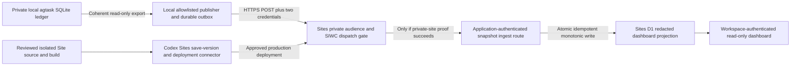

# Codex Site Dashboard Implementation Specification

> **Superseded architecture:** The
> [authoritative local/Sites backend-mode design](specs/2026-08-06-agtask-sites-backend-mode-design.md)
> defines the selected `--mode local|sites` contract. This earlier document
> describes a local-authoritative, read-only Sites projection that is no
> longer the selected design. Retain it for research, D1 considerations, and
> the previously verified private-Sites authentication evidence.

Status: superseded by the authoritative backend-mode design.

Last researched: 2026-08-06.

## Executive decision

The existing agtask dashboard can be represented as a Codex Site whose **hosted
application data** is updated by authenticated HTTP requests, without rebuilding
or redeploying on each update. A hosted application route can write a
Sites-managed D1 database, and the installed Sites connector documents a
site-specific bearer token for identity-less API requests.

A deployed synthetic probe has now verified this behavior for one specific
private access policy: `custom`, with exactly one allowed owner and no groups.
With a valid Sites bypass token and a separate app bearer secret, a scripted
HTTP request wrote a D1 row and immediately updated the deployed page without
redeployment. The Worker received no human identity and did not receive the
platform authorization header. Detailed results are recorded in the
[authenticated API probe report](CODEX_SITE_AUTH_PROBE.md).

This proof does not generalize to workspace-wide, multi-user, or group-based
access policies. Neither public Sites documentation nor the connector contract
states those policies' machine-ingress behavior. Run the authorization matrix
against the exact intended policy, and never make the dashboard public to work
around a failure.

There is **no documented public REST, CLI, CI, or service-account API for
creating, saving, deploying, or changing the source of a Codex Site**. Source,
build, version creation, deployment, access changes, and hosted-secret
configuration remain authenticated ChatGPT/Codex Sites-connector operations.
The inbound application-data API proposed here is not a deployment API.

This document is an implementation specification only. It does not authorize
creating a Site, generating or rotating a bypass token, publishing source,
changing sharing settings, or writing production data.

## Goals

1. Provide an owner-only or explicitly workspace-restricted hosted dashboard for
   a deliberately selected subset of local agtask tasks.
2. Update hosted dashboard content through an authenticated, idempotent HTTP
   request without a new source commit, build, or deployment.
3. Preserve local SQLite as the sole authoritative agtask ledger and preserve
   all existing local lifecycle, merge, hook, upload, and dashboard behavior.
4. Make source publication, environment-secret handling, access policy, data
   projection, ingestion, and viewer authorization independently reviewable.
5. Provide bounded retry, clear freshness, deterministic replay and ordering,
   operational diagnostics, and reversible rollout.
6. Establish a documented proof boundary before assuming private-site machine
   ingress is supported.

## Non-goals

- Replacing the agtask ledger with D1 or synchronizing remote writes into local
  SQLite.
- Exposing local dashboard status changes, bulk actions, close hooks, merge
  leases, task creation, uploads, or attachment downloads from the Site.
- Shipping the entire SQLite database, saved prompts, raw rollouts, filesystem
  paths, local capability URLs, configuration, or source repository history.
- Building a public dashboard, weakening workspace sharing controls, or
  introducing an app-owned OAuth provider.
- Automating Site creation, source push, deployment, access changes, or secret
  rotation through an undocumented external management API.
- Depending on local network reachability from a hosted Worker, a continuously
  running hosted background process, unsupported residency guarantees, or
  Enterprise Site analytics.
- Implementing this proposal as part of the current documentation task.

## Evidence and capability classification

### Publicly documented platform behavior

The [official Codex Sites documentation](https://developers.openai.com/codex/sites)
documents:

- JavaScript/TypeScript full-stack Sites, compatibility checks for existing
  projects, and Sites-managed D1 structured storage.
- `.openai/hosting.json` project linkage and logical D1/R2 bindings.
- Separate **save version** and **deploy version** operations; for local
  projects, a saved version is associated with its source Git commit.
- Owner/admin, selected-user/group, workspace-wide, and, where permitted, public
  audience controls. Sharing allows viewing, not editing.
- Workspace-authenticated browser identity and server-side identity headers.
- Hosted environment variables and secrets; changing them requires redeploying
  an approved saved version before the new environment takes effect.
- ChatGPT web/desktop as the Sites management surfaces; no standalone CLI or IDE
  Sites-management surface is documented.
- Unsupported private-network/background-service patterns and the absence of
  data or inference residency for hosted code, D1/R2, artifacts, and logs.
- Built-in traffic analytics, with the explicit limitation that analytics are
  not currently available to Enterprise-owned Sites.

The [official internal-app guidance](https://learn.chatgpt.com/use-cases/build-and-deploy-internal-apps)
also documents outbound calls to third-party APIs using a hosted secret and
scheduled Codex work that refreshes an app and saves a version for review.
Neither example establishes an external Sites deployment-management API.

### Installed connector contract, not public Sites documentation

The available in-product Sites connector exposes
`sites_generate_siwc_bypass_token({ project_id })`. Its tool contract documents
a bearer token for identity-less API requests and this exact dispatch header:

```http
OAI-Sites-Authorization: Bearer <site-siwc-bypass-token>
```

The contract says that generating a token creates one if absent or immediately
rotates and invalidates the existing token. This is a mutation and must happen
only after an explicit user request. The read-only
`sites_get_site({ project_id })` connector schema observed during this research
also includes this exact optional field:

```ts
sites_get_site({ project_id: string }): {
  result: {
    siwc_bypass_bearer_token?: string | null;
  };
}
```

The schema establishes only that the response **may** contain an existing
token; it does not establish whether any specific caller, role, Site, or
workspace actually receives one. Accessing or reusing that field must have the
same explicit user approval and sensitive handling as other bypass-token access.
Never rely on `sites_get_site` as a guaranteed non-rotating token-discovery
mechanism, and never call the generating tool merely because the optional field
is absent.

The installed Sites starter includes an actual D1-backed application `GET` and
`POST` route:

`/Users/kevinlin/.codex/plugins/cache/openai-bundled/sites/0.1.34/skills/sites-building/templates/vinext-starter/examples/d1/app/api/notes/route.ts`.

The installed authentication reference says private Sites require signed-in
visitors, API handlers must check identity server-side, and SIWC authentication
alone does not establish workspace membership:

`/Users/kevinlin/.codex/plugins/cache/openai-bundled/sites/0.1.34/skills/sites-building/references/authentication.md`.

The distinction matters: custom HTTP handlers and D1 persistence are supported;
machine ingress authentication is documented in an installed first-party tool
contract but not in the public Sites documentation inspected for this spec.

### Empirically verified owner-only deployment

On 2026-08-06, an isolated synthetic Site was deployed with a `custom` policy
allowing exactly one owner and no groups. A user-approved Sites bypass token
and a separately configured hosted application secret produced the following
observed results:

- No platform token, an invalid platform token, or an application secret alone
  received dispatcher HTTP `401` with an HTML response.
- A valid platform token reached the private application; a missing or invalid
  application secret then received the application's JSON HTTP `401`.
- Both valid credentials produced HTTP `200` and durably updated D1.
- Authenticated API read-back, direct D1 connector inspection, and the deployed
  Site's rendered page all contained the same synthetic value without a new
  deployment.
- The successful Worker response reported `identityPresent: false` and
  `platformHeaderForwarded: false`: the request had no workspace-user identity,
  and Sites consumed `OAI-Sites-Authorization` before app code.

The complete redacted matrix and immutable project/deployment identifiers are
in the [authenticated API probe report](CODEX_SITE_AUTH_PROBE.md). This is
deployment-specific evidence, not a publicly documented guarantee for every
Sites access policy.

### Unsupported or unresolved surface

No public Sites documentation or available connector establishes:

- A public Sites REST endpoint for project creation, source upload, version
  creation, deployment, access-policy updates, or D1 writes.
- A standalone external CLI, CI credential, OpenAI API key, or Sites service
  account that performs those management operations.
- Whether the observed owner-only `custom` behavior also applies to
  workspace-wide, multi-user, group-based, or other access-policy modes.
- Token expiry, scopes, route restrictions, workspace authorization, audit
  visibility, rate limits, revocation without rotation, overlap during
  rotation, or which editors can retrieve an existing token.
- Whether header stripping remains consistent across other Sites runtimes or
  policy modes; the verified owner-only deployment did not forward the header.
- Arbitrary D1 writes through the connector. Available Sites D1 tools only
  inspect database metadata and bounded table rows.
- A private-network tunnel from a hosted Site back to the user's loopback
  dashboard or local SQLite database.

Consequently, a private-site ingress proof for the **exact intended access
policy** is a hard implementation prerequisite. The single-owner `custom`
policy has passed that feasibility check; other policies have not.

## Current agtask architecture

### Authoritative data and ownership

The canonical data model is [data_model.md](data_model.md); executable schema,
queries, dashboard server, and client assets live in
[skills/agtask/scripts/agtask](../skills/agtask/scripts/agtask).

- Local SQLite lives at `~/.llm/agtask/ledger.db`, with `AGTASK_DB` available
  for isolated overrides.
- The current schema is `PRAGMA user_version = 8` and includes `thread`,
  `rollout`, `attachment`, `views`, and `project_merge_claim`.
- The database directory is private (`0700`); the database, WAL, and SHM files
  are private (`0600`). The CLI owns writes; Codex owns the complete task
  conversation.
- Lifecycle values are `todo`, `active`, `blocked`, `merging`, `done`, and
  `drop`. The local task UUID, Codex session ID, and parent session ID have
  distinct semantics.
- Rollout summaries, titles, project names, task descriptions, identifiers, and
  file names may still reveal confidential work even when raw conversations are
  not stored.

### Existing dashboard

`agtask dashboard` is a Python standard-library `ThreadingHTTPServer` with
embedded HTML, CSS, and JavaScript. It binds `127.0.0.1` on an ephemeral port
and protects every route with an unguessable URL path token, strict `Host`
validation, exact `Origin` checks for writes, and restrictive browser headers.

Existing token-scoped routes provide:

- Grouped JSON dashboard snapshots and task-detail timelines.
- Guarded single-row and atomic bulk status transitions using an
  `expected_status` compare-and-swap contract.
- Local Markdown/plain-text attachment upload into private managed storage.
- Manual refresh, project/parent/status filters, saved views, search, sorting,
  abbreviated copyable identities, and local editor/Codex deep links.

The dashboard's direct `done` action intentionally bypasses `OnPreClose`,
`OnPostClose`, merge claims, and normal CLI finalization. These ownership rules
must remain local; copying the UI into a hosted environment must not accidentally
expose the existing local mutation contract.

`agtask dashboard --json` already emits a one-shot grouped snapshot without
starting a server. However, it is **not a safe hosted export**: project, parent,
and status facets are computed across the complete ledger before project filters
are applied; saved views can reveal additional state; and each task's attachment
projection includes resolved absolute paths and editor URLs. A project-filtered
snapshot can therefore leak unrelated projects and machine-local information.

There is currently no JavaScript package/build system, Sites manifest, hosted
application, publisher, durable replication cursor, or remote ledger API in the
agtask project. More detail is in [ARCHITECTURE.md](ARCHITECTURE.md) and
[CLI.md](CLI.md).

## Proposed Codex Site architecture



The Site is a read-only hosted projection, not a network-exposed copy of the
Python server. A local publisher reads an explicitly authorized ledger subset,
removes sensitive fields, and submits coherent snapshots to a hosted Worker API
route. The route authenticates independently, validates the payload, and stores
the materialized projection in D1. Workspace-authenticated viewers read D1
through server-rendered pages or protected read APIs.

Source changes follow the Sites build/save/deploy lifecycle. Subsequent data
updates change only D1 and become visible through the already-deployed app.

## Source, build, deployment, and ledger ownership

| Concern | Owner | Required boundary |
| --- | --- | --- |
| Canonical task state and lifecycle writes | Local agtask CLI and SQLite ledger | The hosted app never writes back to local SQLite. |
| Hosted export eligibility | Explicit local publisher configuration | Require a nonempty project allowlist and recompute every facet from that subset. |
| Approved hosted source identity and project allowlist | Site owner through reviewed Sites environment configuration | Version one permits exactly one source; configuration changes require explicit approval and redeployment. |
| Canonical dashboard Site source | A reviewed, dedicated agtask Site subtree or separately owned repository | Include only approved Site code, migrations, configuration, and assets. |
| Sites-managed Git source remote | An isolated managed-source mirror rooted at the Site source | Never push the enclosing shared repository or its unrelated files/history. |
| Worker build and migration generation | Site source build | Produce the Sites-compatible Worker entrypoint, assets, hosting manifest, and migrations. |
| Project creation, source credential, version save, deploy, sharing, and hosted secrets | Authenticated ChatGPT/Codex Sites connector | Require the appropriate user authorization; no external REST-management API is assumed. |
| Hosted dashboard data | D1 as a replaceable derived projection | Materialize only allowlisted task data and publication metadata. |
| Update initiation | Local authorized publisher or approved local automation | Keep credentials outside source, SQLite rows, prompts, proof artifacts, and logs. |
| Viewer access | Sites audience policy plus server-side user checks | Keep owner-only or explicitly selected workspace access. |

Because the agtask checkout is inside a larger shared Git root, pointing the
Sites-managed source remote at that root risks publishing unrelated source and
history. The future implementation must create an isolated source mirror that
contains only the reviewed Site tree. Its pushed commit must exactly match the
build archive and D1 migrations used to save the Site version.

The first approved deployment follows the installed hosting contract:

1. Create or reuse the Site project and persist only its opaque `project_id`
   plus logical D1/R2 bindings in the isolated `.openai/hosting.json`.
2. Obtain a short-lived Sites-managed source-repository credential. Use it only
   as per-command Git authorization; never embed it in a remote URL or config.
3. Push the exact reviewed Site-source commit to the isolated managed remote.
4. Build a supported Worker bundle and include reviewed D1 migrations.
5. Call `sites_save_site_version({ project_id, commit_sha, archive })`.
6. Use the appropriate private deployment connector for an owner-only Site;
   obtain explicit approval for any deployment that changes an existing shared
   audience.
7. Poll deployment status and verify the production URL and intended access.

A source-repository write token, SIWC-bypass token, and application ingestion
secret are three separate credentials with separate scopes and rotation rules.

### Version-one source policy and administration

Version one supports exactly one publisher source and one explicit project
allowlist. The Site owner configures these hosted environment values through the
authenticated Sites connector:

- `AGTASK_ALLOWED_SOURCE_ID`: one opaque publisher UUID.
- `AGTASK_ALLOWED_PROJECTS_JSON`: one nonempty JSON array of exact project
  names, normalized and reviewed before deployment.
- `AGTASK_INGEST_SECRET`: an independent application bearer secret, configured
  with `is_secret: true`.

The handler rejects requests whose source ID or normalized project set differs
from that deployed policy. There is no mutable D1 source registry, dynamic
source enrollment, browser administration route, or external Site-management
API in version one. Adding or removing a source, widening/narrowing its project
scope, or changing its app secret requires an explicit owner-approved Sites
environment update and approved-version redeploy. A scope reduction must first
publish an authorized empty replacement whose envelope still declares the
currently deployed exact scope, then deploy the new narrower policy before
publishing newly scoped tasks. Never leave old broader rows visible during a
policy transition. Supporting multiple publishers requires a separate
authorization and administration design.

## Exact API, authentication, and request flow

### Phase-zero private-access proof

Before implementing production migration, use a deliberately non-sensitive
private test Site and an explicitly approved existing or newly generated bypass
token to prove all of the following:

| Request | Required result |
| --- | --- |
| No platform token and no app secret | Sites rejects access before the application updates data. |
| App secret without platform token | The private Sites audience/SIWC gate rejects access. |
| Platform token without app secret | The request may reach the route, but the application returns `401` and performs no write. |
| Platform token plus incorrect app secret | Application returns `401`; no write. |
| Platform token plus valid app secret | Intended private audience policy permits the request and the route applies the authorized update. |
| Authorized workspace browser viewer | Normal Sites audience and server-side viewer authorization still succeed. |
| Viewer outside the intended audience | Access remains denied. |
| Old platform token after an explicitly requested rotation | The old token is rejected. |

Run the matrix against the exact intended audience mode: owner/admin-only,
workspace-wide, or custom group/user policy. Success for a public Site or a
different access mode does not establish private-site support.

If either the platform gate cannot be crossed without weakening the dashboard's
audience or the bypass unexpectedly grants browser access beyond the approved
boundary, stop. Keep the existing dashboard unchanged and use only a separately
approved fallback.

### HTTP request

After the phase-zero proof succeeds, the publisher sends an HTTPS request to
`https://<private-sites-host>/api/agtask/v1/snapshots`:

```http
POST /api/agtask/v1/snapshots HTTP/1.1
Host: <private-sites-host>
OAI-Sites-Authorization: Bearer <site-siwc-bypass-token>
Authorization: Bearer <application-ingest-secret>
Idempotency-Key: <source-id>:<publication-sequence>
Content-Type: application/json; charset=utf-8
Accept: application/json

<versioned redacted snapshot envelope>
```

`OAI-Sites-Authorization` is consumed by Sites dispatch and must not be assumed
to reach the Worker. The independent `Authorization` credential is verified in
server-side application code against a hosted Sites secret using constant-time
comparison. A documented, reviewed timestamped HMAC can replace the app bearer
credential later if stronger replay controls are required.

Bypass requests are explicitly identity-less: `getChatGPTUser()` must not be
required for the machine ingestion route and must not be treated as populated.
Conversely, browser pages and viewer APIs continue to require the intended Sites
audience policy and server-side authenticated user identity.

Reject non-HTTPS production origins, redirects, oversized bodies, incorrect
methods, unsupported content types, unknown fields, unknown `source_id`
values, disallowed project scopes, unsupported schema versions, mismatched
digests, stale sequences, and invalid timestamps. Require bounded timeouts and
never place either token in a URL or query parameter.

### Freshness heartbeat

Unchanged task content must not increment its publication sequence merely to
demonstrate publisher health. The same two credentials therefore protect a
separate bounded endpoint:

```http
POST /api/agtask/v1/heartbeats HTTP/1.1
Host: <private-sites-host>
OAI-Sites-Authorization: Bearer <site-siwc-bypass-token>
Authorization: Bearer <application-ingest-secret>
Content-Type: application/json; charset=utf-8

{
  "source_id": "<stable-opaque-publisher-uuid>",
  "publication_sequence": 42,
  "content_sha256": "<currently-applied-snapshot-digest>",
  "observed_at": "2026-08-06T20:20:00.000Z",
  "refresh_after": "2026-08-06T20:35:00.000Z"
}
```

The D1 update is conditional on the currently stored source, sequence, and
digest, and only advances `refresh_after`; equal or older deadlines are a
no-op. A mismatched source/sequence/digest returns `409` without changing the
projection. Initial targets are a five-minute publisher cadence and a maximum
15-minute freshness deadline; the handler rejects requests that extend the
deadline beyond its approved bound. Both are configurable only through reviewed
Site policy. The dashboard hides task rows once their source deadline expires
and displays a stale-source state until a matching heartbeat or newer snapshot
arrives.

### Response contract

| Status | Meaning | Publisher behavior |
| --- | --- | --- |
| `200` | Previously applied identical request; no change. | Mark the outbox item acknowledged. |
| `201` | Snapshot newly applied. | Mark acknowledged and record the returned revision. |
| `400` or `422` | Invalid envelope, schema, digest, scope, or size. | Fail closed; require correction; do not retry unchanged input. |
| `401` or `403` | Platform or app credential/access policy rejected. | Stop automatic retries after a bounded check; require credential/policy review. |
| `409` | Sequence conflict, reused key with different content, or stale predecessor. | Do not overwrite newer state; reconcile the publisher checkpoint. |
| `413` | Snapshot exceeds the approved payload limit. | Stop and reduce scope or implement an explicitly reviewed paging contract. |
| `429` or `503` | Capacity, D1 contention, or temporary platform failure. | Retry the identical persisted request with bounded exponential backoff and jitter. |
| Network timeout | Delivery outcome unknown. | Retry the exact same body, sequence, and idempotency key. |

Successful responses include `schema_version`, `source_id`,
`publication_sequence`, `content_sha256`, `applied_at`, and `deduplicated`.
Never include submitted credentials, task descriptions, attachment paths, or raw
platform internals in errors.

## Data contract

### Canonical publication envelope

The precise version-one allowlist is intentionally narrower than the existing
local dashboard snapshot:

```json
{
  "schema_version": 1,
  "source_id": "<stable-opaque-publisher-uuid>",
  "publication_sequence": 42,
  "expected_previous_sequence": 41,
  "generated_at": "2026-08-06T20:15:00.000Z",
  "source_timezone": "America/Los_Angeles",
  "refresh_after": "2026-08-06T20:20:00.000Z",
  "scope": {
    "projects": ["agtask"]
  },
  "content_sha256": "<sha256-of-canonical-allowlisted-content>",
  "content": {
    "total_count": 2,
    "visible_count": 2,
    "facets": {
      "projects": [{ "value": "agtask", "count": 2 }],
      "statuses": [
        { "value": "active", "count": 1 },
        { "value": "done", "count": 1 }
      ]
    },
    "groups": [
      {
        "status": "active",
        "count": 1,
        "tasks": [
          {
            "task_id": "<opaque-local-task-uuid>",
            "project": "agtask",
            "title": "Review approved dashboard scope",
            "status": "active",
            "created_at": "2026-08-06T19:45:00.000Z",
            "updated_at": "2026-08-06T20:10:00.000Z",
            "closed_at": null
          }
        ]
      },
      {
        "status": "done",
        "count": 1,
        "tasks": [
          {
            "task_id": "<opaque-local-task-uuid>",
            "project": "agtask",
            "title": "Validate hosted read-only projection",
            "status": "done",
            "created_at": "2026-08-06T18:00:00.000Z",
            "updated_at": "2026-08-06T19:00:00.000Z",
            "closed_at": "2026-08-06T19:00:00.000Z"
          }
        ]
      }
    ]
  }
}
```

The example demonstrates shape; implementation must retain the existing fixed
`todo`, `active`, `blocked`, `merging`, `done`, `drop` lifecycle order and
deterministic tie-breaking. Empty groups and optional saved views must have an
explicitly documented version-one policy before publication.

Canonical digest input includes only deterministic semantic data: the schema
version, normalized source identity/scope, explicitly allowlisted views if any,
and the complete materialized `content`. It excludes `generated_at`, transport
headers, retry timestamps, and other volatile metadata. Equivalent unchanged
content must produce identical canonical bytes and digest. Sort object keys,
project lists, facets, groups, and task ties deterministically; reject NaN,
unknown fields, ambiguous timestamps, and duplicate task IDs.

### Explicitly excluded fields

Version one never publishes:

- Raw SQLite files, WAL/SHM contents, database schema dumps, or merge claims and
  fencing tokens.
- Task descriptions, rollout messages, raw prompts, assistant transcripts,
  bootstrap metadata, hook prompts, environment variables, or app configuration.
- Attachment bytes, basenames, full filesystem paths, `vscode://` URLs,
  `codex://` deep links, capability tokens, or loopback dashboard URLs.
- Codex `session_id`, `parent_session_id`, user email, display name, or any
  unrelated project's task, facet, saved view, count, or identifier.

Task IDs, titles, and project labels remain potentially sensitive. A future
privacy mode may replace task IDs with source-scoped pseudonyms or omit titles;
those changes require an explicit contract review rather than broadening the
default projection.

### Scope and coherent reads

Publisher configuration must require an explicit, nonempty exact-project
allowlist. Derive task rows first, then compute **all** groups, status counts,
project facets, totals, views, and any future parent facets from only those
authorized rows. Never forward or trim `agtask dashboard --json` after its
global facets have already been computed.

Build the complete export inside a coherent read-only SQLite transaction. Saved
views, attachments, and rollouts have independent change patterns and must be
included in the same coherent snapshot if a future schema intentionally allows
them. Version one omits all of them unless an explicitly reviewed view can be
fully re-materialized from authorized rows.

The built-in `today` view follows the source machine's local calendar day, so
its visible membership can change at local midnight without any database write.
When time-relative views are enabled, persist `source_timezone`, compute the
next local-midnight boundary with daylight-saving rules, and publish again at or
before that boundary. `thread.updated` alone is not a complete change cursor:
rollout-only changes, independent saved-view edits, tied millisecond timestamps,
and calendar transitions can all invalidate timestamp-only replication.

## Idempotency, ordering, and concurrency

### Local publisher state

Maintain source identity, the last acknowledged publication sequence/digest,
and a single exact in-flight envelope in private publisher-owned state outside
the canonical agtask ledger. Use a source-specific advisory lock and `0600`
state/outbox files or an equivalently private dedicated publisher store.

For each requested refresh:

1. Acquire the source lock and recover any persisted in-flight request.
2. Materialize and canonicalize one coherent authorized snapshot.
3. If its semantic digest matches the acknowledged digest and no time-relative
   refresh boundary has changed, send only a bounded freshness heartbeat;
   never increment the publication sequence for unchanged content.
4. Otherwise reserve `acknowledged_sequence + 1`, set
   `expected_previous_sequence` to the acknowledged value, and persist the
   complete exact request before performing network I/O.
5. Retry that same byte-for-byte request, idempotency key, and sequence until a
   bounded success, terminal rejection, or operator handoff.
6. Advance the local checkpoint only after a matching successful response;
   clear the in-flight record atomically with the checkpoint update.

A crash after the Site commits but before local acknowledgment is repaired by
replaying the identical persisted request. Two processes on the same machine
must not generate independent sequences for the same `source_id`.

### Hosted D1 application semantics

Version one uses one canonical JSON snapshot row rather than individually
materialized tasks. This makes full replacement and deletion one SQL update,
avoids transient partially visible task sets, and prevents receipt rows from
duplicating sensitive titles. Approved source identity and project scope come
only from the deployed environment policy, not from a mutable D1 registry.

The reviewed D1 migration defines:

```sql
CREATE TABLE publication_state (
  source_id TEXT PRIMARY KEY NOT NULL,
  current_sequence INTEGER NOT NULL CHECK (current_sequence >= 0),
  content_sha256 TEXT NOT NULL,
  snapshot_json TEXT NOT NULL CHECK (json_valid(snapshot_json)),
  last_attempt_id TEXT NOT NULL,
  applied_at TEXT NOT NULL,
  refresh_after TEXT NOT NULL
);

CREATE TABLE publication_receipt (
  source_id TEXT NOT NULL,
  idempotency_key TEXT NOT NULL,
  publication_sequence INTEGER NOT NULL CHECK (publication_sequence > 0),
  expected_previous_sequence INTEGER NOT NULL
    CHECK (expected_previous_sequence >= 0),
  attempt_id TEXT NOT NULL UNIQUE,
  request_sha256 TEXT NOT NULL,
  content_sha256 TEXT NOT NULL,
  response_json TEXT NOT NULL CHECK (json_valid(response_json)),
  applied_at TEXT NOT NULL,
  expires_at TEXT NOT NULL,
  PRIMARY KEY (source_id, idempotency_key),
  UNIQUE (source_id, publication_sequence),
  FOREIGN KEY (source_id)
    REFERENCES publication_state(source_id) ON DELETE CASCADE
);

CREATE INDEX publication_receipt_expiry_idx
  ON publication_receipt(expires_at);

CREATE TRIGGER publication_receipt_validate
BEFORE INSERT ON publication_receipt
FOR EACH ROW
BEGIN
  SELECT CASE
    WHEN (
      SELECT current_sequence
      FROM publication_state
      WHERE source_id = NEW.source_id
    ) IS NULL
      THEN RAISE(ABORT, 'unknown publication source')
    WHEN NEW.publication_sequence != (
      SELECT current_sequence
      FROM publication_state
      WHERE source_id = NEW.source_id
    )
      THEN RAISE(ABORT, 'publication checkpoint did not advance')
    WHEN NEW.content_sha256 != (
      SELECT content_sha256
      FROM publication_state
      WHERE source_id = NEW.source_id
    )
      THEN RAISE(ABORT, 'publication content did not match')
    WHEN NEW.attempt_id != (
      SELECT last_attempt_id
      FROM publication_state
      WHERE source_id = NEW.source_id
    )
      THEN RAISE(ABORT, 'publication state was not updated by this attempt')
    WHEN NEW.publication_sequence != NEW.expected_previous_sequence + 1
      THEN RAISE(ABORT, 'non-monotonic publication sequence')
  END;
END;
```

Before any D1 write, verify both credentials, the deployed source/scope policy,
body limits, canonical digest, exact raw-body SHA-256, and the required
`<source_id>:<publication_sequence>` idempotency key. Query an existing receipt
first. If its exact request digest, content digest, and sequence match, return
its stored success response; otherwise return `409`.

For a previously unseen request, generate one fresh opaque internal
`attempt_id`, prepare exactly these statements, and pass them to one
`env.DB.batch()` call in this order:

```sql
-- Statement 1: create the source's zero checkpoint if this is its first write.
INSERT INTO publication_state (
  source_id, current_sequence, content_sha256, snapshot_json,
  last_attempt_id, applied_at, refresh_after
)
VALUES (?, 0, '', '{}', '', ?, ?)
ON CONFLICT(source_id) DO NOTHING;

-- Statement 2: conditionally replace the projection and mark this attempt.
UPDATE publication_state
SET current_sequence = ?,
    content_sha256 = ?,
    snapshot_json = ?,
    last_attempt_id = ?,
    applied_at = ?,
    refresh_after = ?
WHERE source_id = ?
  AND current_sequence = ?
  AND ? = current_sequence + 1
RETURNING current_sequence, content_sha256;

-- Statement 3: prove statement 2 actually advanced this exact attempt.
INSERT INTO publication_receipt (
  source_id, idempotency_key, publication_sequence,
  expected_previous_sequence, attempt_id, request_sha256,
  content_sha256, response_json, applied_at, expires_at
)
VALUES (?, ?, ?, ?, ?, ?, ?, ?, ?, ?);
```

Statement 2 updates a row only when its current sequence is the exact expected
predecessor and the requested sequence is its immediate successor. An SQLite
`UPDATE` matching zero rows is not itself an error, so statement 3's trigger is
the mandatory atomicity guard: it verifies the post-update sequence, content
digest, and freshly generated `attempt_id`. If statement 2 matched no row, the
stored `last_attempt_id` cannot equal this invocation's new attempt ID, so the
receipt trigger raises `ABORT` **inside the still-active D1 batch**. This rolls
back every prior statement and prevents an orphaned receipt or partially
replaced projection. The same atomic rollback applies to uniqueness, JSON,
foreign-key, size, and other SQL failures. Application code also verifies that
statement 2 returned exactly one row, but correctness never depends on
post-commit JavaScript discovering a silent no-op. Prove both batch-result
metadata and trigger rollback on the actual Sites-backed D1 runtime before
approving phase three.

If two equivalent requests race after the receipt pre-read, one transaction
wins. The other hits a uniqueness or stale-predecessor failure, re-reads the
committed receipt, and returns the stored success only when its exact request
digest, sequence, and content digest all match. A reused key with different
bytes, an older sequence, a missing predecessor, or a different task snapshot
returns `409` and never overwrites the newer state.

Heartbeat freshness uses one separately prepared conditional update:

```sql
UPDATE publication_state
SET refresh_after = ?
WHERE source_id = ?
  AND current_sequence = ?
  AND content_sha256 = ?
  AND refresh_after < ?
RETURNING current_sequence, content_sha256, refresh_after;
```

For an equal or older deadline, first verify the current source/sequence/digest
and return a no-op; a different current snapshot returns `409`. Enforce the
maximum future deadline before this query. Delete expired receipt rows in a
separate bounded maintenance batch after a successful snapshot or heartbeat;
maintenance failure must not roll back or misreport an already acknowledged
publication.

Use prepared SQL rather than multi-statement `exec()` for application
transactions. Run the trigger only as a reviewed generated migration, and prove
that Sites-backed D1 accepts it. Payload limits, trigger behavior, receipt
retention, and overload characteristics must be measured on the actual Sites
deployment instead of inferred from a raw Cloudflare account.

### Deletions and scope changes

Every accepted snapshot is a complete replacement for its authorized source
and scope. Tasks absent from the new snapshot are deleted from the hosted
projection in the same transaction, including tasks removed from the local
ledger or newly excluded by a narrower project allowlist.

Changing the source's approved project set requires the owner-controlled Sites
environment update and redeployment described above. The current producer first
publishes an authorized empty full replacement labeled with the currently
approved scope; then the owner deploys the new exact policy and the producer
resumes only after a newly reviewed scoped snapshot. Decommissioning first
publishes an empty replacement, then disables the application secret or source
policy through an approved environment update and redeploy.

## Ledger and dashboard integration

The existing Python ledger and dashboard remain the system of record and local
interactive interface. A future agtask publisher command should reuse validated
read-only connections and narrowly scoped query helpers without adding hosted
dependencies to normal CLI invocations.

Initial hosted parity should include only:

- Lifecycle grouping and deterministic ordering.
- Scoped project/status filters, literal title/task-ID search, and timestamps.
- Last successful publication time, source timezone, and freshness state.
- A clear read-only indication and a no-data/paused-source state.

Do not render status-edit controls, bulk actions, close/reopen buttons, file
attachment controls, task descriptions, rollout timelines, editor links, or
Codex deep links. If future product requirements need those features, first
specify remote command authorization, local execution ownership, lifecycle
hooks, merge fencing, optimistic concurrency, audit, and privacy review in a
separate proposal.

Publisher triggering may initially be an explicit command. Optional local
scheduling can follow after the privacy and failure behavior are verified;
Sites Workers must not be assumed to host a persistent local-ledger observer.
Any hook-driven future trigger must be best effort, bounded, asynchronous with
respect to ledger mutation, and incapable of breaking the underlying task
lifecycle if publication fails.

## Security and privacy boundaries

1. **Keep the Site private.** Start owner/admin-only; widen only to explicitly
   approved workspace users or groups. Public publishing is not a fallback.
2. **Use independent credentials.** The platform bypass token authenticates
   Sites dispatch; the separate application secret authorizes only the machine
   ingest handler. Never assume that the bypass token is route scoped.
3. **Do not rotate silently.** Token generation immediately invalidates an
   existing token. Obtain explicit approval, stop publishers, rotate once,
   distribute securely, verify, and resume. No overlapping validity or
   zero-downtime rotation is documented.
4. **Treat token reads as sensitive.** `sites_get_site` may expose an existing
   bypass token; do not print it, persist it in repo files, or assume every
   viewer/editor can safely retrieve it. Record only redacted token provenance.
5. **Configure app secrets through Sites.** Mark the ingest secret sensitive,
   keep it out of `.openai/hosting.json`, and redeploy the approved version
   after changing the hosted environment revision.
6. **Use least-privilege source handling.** Push only the isolated approved Site
   tree. Never upload the broader shared Git checkout, local SQLite, unrelated
   worktrees, unpublished notes, credentials, or private keys.
7. **Separate machine and browser identity.** The ingestion route intentionally
   handles an identity-less request; all human-viewer surfaces remain protected
   by Site access policy and server-side identity/authorization checks.
8. **Minimize and validate data.** Enforce a schema-level allowlist, explicit
   project scoping, bounded payload sizes, safe text rendering, no HTML
   injection, and scoped recomputation of every aggregate.
9. **Respect retention and geography limits.** Sites provides no data or
   inference residency for code, D1/R2, artifacts, or logs. Apply the concrete
   version-one retention rules below and publish no real task titles until the
   owner accepts the unresolved platform log-retention boundary.
10. **Protect diagnostics.** Redact both credentials, auth headers, raw request
    bodies, confidential titles where appropriate, task descriptions, local
    paths, and signed URLs from Worker logs, publisher logs, proofs, and error
    reports.
11. **Bound network behavior.** Use HTTPS, verify the exact approved host,
    disable credential-bearing cross-host redirects, enforce timeouts and body
    limits, and retry only idempotent preserved requests.
12. **Plan revocation limits.** Because no standalone bypass revoke, TTL, scope,
    or audit contract is documented, credential compromise requires immediate
    approved token rotation and possibly tightening/disabling Site access.

### Version-one retention and incident policy

The initial policy is deliberately bounded:

- The D1 state contains exactly one latest redacted snapshot for the one
  approved source. Every newer full snapshot replaces the previous JSON in the
  same transaction; no historical task snapshots are retained by the app.
- Viewer pages hide all task rows once the 15-minute freshness deadline passes.
  Hiding is an access/presentation control, not a guarantee that stale bytes
  were physically deleted from D1.
- Idempotency receipts contain only source identity, digests, timestamps, keys,
  and a small response; they never contain task titles or snapshot JSON. Set
  `expires_at` to seven days and perform bounded lazy deletion after successful
  snapshot or heartbeat requests.
- Sites documents neither an application-owned background deletion service nor
  a platform-level receipt TTL. If no future request occurs, expired receipt
  rows can remain until the next approved maintenance-triggering request.
- On planned decommissioning or unauthorized data publication, stop the local
  publisher, restrict Site access immediately, submit an approved empty full
  snapshot while valid credentials remain available, and disable the source/app
  secret through an approved environment update plus redeploy.
- If an empty replacement cannot be submitted or hard physical-deletion
  deadlines apply, do not claim that hiding, lazy cleanup, or restricting Site
  access erased D1 data. Escalate to the Sites owner/platform operator or use a
  separately approved Site deletion workflow; do not publish real data until
  that deletion path satisfies the applicable policy.
- Application/Worker logs must never include request bodies, credentials,
  titles, session identifiers, filesystem paths, or full task IDs. The platform
  Worker-log retention duration and deletion controls are undocumented; owner
  approval of that residual risk is mandatory before publishing real titles.
- Site source commits and build archives must contain code and synthetic
  fixtures only, never real snapshots. Never place live ledger exports in Git,
  build output, review screenshots, or integration proof.

## Failure, recovery, and rollback

| Failure | Required behavior | Recovery or rollback |
| --- | --- | --- |
| Private-site machine-ingress proof fails | No production migration; no audience broadening. | Retain the local dashboard and select an explicitly approved fallback. |
| Local ledger missing, incompatible, locked, or unreadable | No partial export and no hosted state mutation. | Report the exact local error; retry read-only after recovery. |
| Publisher scope empty or an unrelated facet appears | Fail closed before sending any request. | Correct allowlist/projection and rerun privacy tests. |
| Network failure or ambiguous timeout | Preserve exact pending request. | Retry the same idempotency key and bytes with bounded backoff. |
| Expired/rotated platform or app credential | Stop after bounded authentication checks. | Securely restore the approved credential; redeploy after app-secret changes. |
| D1 write failure or contention | Projection and watermark remain unchanged. | Retry on retryable failure; inspect redacted Worker logs. |
| Sequence conflict or mismatched replay | Preserve the newest hosted state. | Reconcile publisher state against authorized source metadata; never force overwrite. |
| Deployed Site version is broken | Existing local dashboard remains available. | Redeploy the last approved saved Site version through the Sites connector. |
| New migration is incompatible | Stop rollout before destructive schema changes. | Use a compatible prior version/migration plan or recreate only the derived D1 projection. |
| Sensitive data is published | Stop publisher, restrict Site access, and remove affected derived records. | Follow incident procedures; assess D1, saved versions, Worker logs, and source artifacts. |
| Bypass token is compromised | Stop ingestion and restrict access if required. | Explicitly rotate, distribute the replacement securely, and verify the old token fails. |
| Source is decommissioned or scope shrinks | Do not leave stale task rows visible indefinitely. | Apply an authorized empty/reduced full snapshot and purge retained receipts on schedule. |

The hosted D1 state is disposable derived data. Rolling back the Site must
never modify or roll back the canonical local ledger. Site version rollback and
data-state rollback are separate operations and need independent runbooks.

## Migration plan

1. Capture the current local dashboard and ledger contract without changing
   user-facing behavior.
2. Prove private-site machine ingress against non-sensitive synthetic data and
   the exact intended audience policy.
3. Define and review the smallest allowed project scope, field allowlist,
   retention policy, hosted-source isolation, and credential ownership.
4. Create the isolated Site source, D1 migration, read-only synthetic dashboard,
   and app-authenticated ingestion route only after phase-zero approval.
5. Add a local dry-run exporter that never sends data until an operator reviews
   the exact projected payload and verifies no unrelated facets or paths leak.
6. Deploy the private Site using the approved Sites connector workflow; publish
   one explicitly authorized initial snapshot.
7. Shadow the hosted read-only view against the existing local dashboard for
   the approved subset, without replacing or redirecting local users.
8. Add bounded manual refresh/replay, freshness indicators, log inspection,
   conflict tests, credential-rotation rehearsal, and source-removal cleanup.
9. Enable approved local scheduling only after the manual path and operational
   runbooks are stable.
10. Retain the existing loopback dashboard indefinitely unless a separate
    decision explicitly authorizes retirement.

## Observability

The local publisher should emit structured, redacted events for:

- `source_id`, approved scope fingerprint, publication sequence, and abbreviated
  content digest.
- Export duration, task/group counts, canonical payload size, next freshness
  deadline, request duration, retry count, and terminal response class.
- Deduplicated replay, stale-sequence rejection, D1 overload, access denial,
  schema rejection, source-lock contention, and midnight-driven refresh.

The Site should emit similarly redacted ingest events and expose an authorized
freshness/status view with the last successful apply time and publication
sequence. Use `sites_get_site_worker_logs` for bounded, read-only Worker
diagnostics and the Sites deployment-status/version tools for deployment
failures.

Never depend on Enterprise Site analytics for monitoring: official Sites
documentation explicitly limits current analytics availability for
Enterprise-owned Sites. Define alerts around publisher staleness and repeated
authorization/ingestion failures using an already approved local mechanism.

## Testing strategy

### Documentation-stage verification

For this spec-only change, validate Markdown structure, required section
coverage, official citations, exact Sites auth header spelling, and a clean
scoped diff containing only this new document. Do not run implementation or
deployment workflows.

### Future local exporter tests

- Exact-project allowlist enforcement; unrelated project, parent, status, saved
  view, totals, and facet leakage are impossible.
- Field allowlist rejects paths, attachments, session IDs, parent IDs,
  descriptions, rollout text, secrets, and unknown JSON fields.
- Snapshot consistency under concurrent local status updates and unrelated
  ledger writes.
- Canonical digest stability, deterministic ordering, equal millisecond
  timestamps, unchanged-content heartbeat without sequence advancement,
  local-midnight transitions, and DST.
- Private outbox permissions, crash after remote apply, exact replay, duplicate
  local publishers, and sequence-checkpoint recovery.
- Missing/incompatible/locked ledger, bounded timeouts, redirect refusal,
  oversize payloads, and retry/backoff classification.

### Future Site and D1 tests

- The complete phase-zero private-access authorization matrix.
- Independent machine-secret verification and normal human-viewer identity
  checks, including users outside the authorized workspace/group.
- Accepted insert, exact duplicate, reused key with different bytes,
  out-of-order sequence, concurrent same-source requests, stale predecessor,
  rollback after each mid-batch failure, the migration trigger, exactly one
  guarded `RETURNING` row, and atomic full-snapshot replacement/deletion.
- Exact single-source/scope environment enforcement, owner-approved policy
  changes, old-snapshot clearing before scope reduction, and source
  decommissioning.
- Matching/older/stale heartbeats, bounded deadline extension, and dashboard
  suppression after the freshness deadline.
- D1 migration generation, bounded receipt retention, payload limits, overload
  handling, lazy cleanup without guaranteed background deletion, source
  isolation, and freshness reporting.
- Safe rendering of adversarial task titles and project labels without storing
  unapproved personal or confidential fields in Worker logs.
- Secret updates followed by approved-version redeploy and explicitly approved
  bypass-token rotation that rejects the previous token.

### Existing agtask regression boundaries

When implementation eventually begins, run only affected focused tests, such as
the existing dashboard Python/client suites and any newly added exporter/Site
tests. Preserve local loopback token protection, exact `Host`/`Origin` checks,
read-only snapshots, atomic status changes, managed upload cleanup, and
hook-free local dashboard `done` behavior.

The existing integration manifest's `dashboard-html` scenario is version 16.
Update only scenarios actually affected by future implementation; keep the
manifest, executable assertions, and proof version synchronized. Bump the
overall suite version only if shared setup or proof format changes. Run the
complete integration suite only when explicitly requested.

Never run `npm run precommit`.

## Alternatives

### Scheduled Codex refresh and reviewed redeployment

Official internal-app guidance supports scheduled Codex work that fetches
connected data, updates app content, and saves a version for review. This avoids
an externally callable application-ingestion token but changes the deployment
model: source/build/version updates replace D1-only data refresh, and deployment
still requires the appropriate user approval. It is unsuitable as an equivalent
high-frequency ledger API.

### Site-side outbound pull from an authenticated feed

Sites can call an external third-party API using a hosted secret. An agtask
design could pull from a separately hosted authenticated redacted ledger feed.
However, the existing ledger and dashboard are local-only; a Site is not
documented to reach localhost or private networks. This alternative therefore
adds an independently hosted ingestion service and expands the security
boundary. Do not infer that a user's local dashboard is remotely reachable.

### Keep the existing local dashboard

If private-site machine auth, data residency, retention, sharing, or secret
management cannot satisfy the required policy, retain the existing local
dashboard. Its current loopback capability URL, strict local-origin checks, and
private SQLite remain the safest baseline.

## Open questions

1. Does the verified single-owner `custom` bypass behavior also hold for
   workspace-wide, multi-user, group-based, or other restricted policies
   without weakening viewer authorization?
2. Is the observed stripping of `OAI-Sites-Authorization` guaranteed across
   other Sites runtimes, routes, versions, and access policies?
3. What token expiry, editor/owner visibility, revocation, rate limit, audit,
   policy scoping, and incident-response guarantees apply to bypass tokens?
4. Which approved local secret store and automation identity should hold the
   platform token and independent application secret?
5. Should the canonical Site live in a dedicated agtask subtree or a separate
   repository, and which isolated mirror will own its managed Sites Git remote?
6. Which exact projects, task titles, opaque task identifiers, and lifecycle
   values are acceptable to publish to the chosen viewer group?
7. Must saved views, parent relationships, session links, or rollout summaries
   ever appear, or should they remain permanently local?
8. What D1 capacity and body limits apply to the actual Sites workspace, and do
   they support the proposed seven-day receipt window, five-minute heartbeat,
   15-minute freshness deadline, and single-source design?
9. What platform-controlled D1 physical-deletion and Worker-log retention
   guarantees exist beyond the explicitly bounded app-level retention policy?
10. Which local scheduling mechanism can publish safely without coupling remote
    availability to task creation, close hooks, or merge-lease timing?
11. Is a bearer app secret adequate, or does policy require timestamped HMAC,
    nonce retention, credential overlap, or an additional approved network
    control?

## Phased implementation plan

### Phase 0: capability and authorization gate

- **Observed outcome:** the deployed synthetic single-owner `custom` Site
  passed valid/invalid platform-token and application-token cases; a valid
  two-credential request updated D1 and the rendered page without redeployment.
  Broader audience policies, an actual second unauthorized workspace viewer,
  and token-rotation overlap remain untested.
- Obtain explicit approval for any non-sensitive test Site and any bypass-token
  retrieval/generation.
- Prove the exact private-access authorization matrix and capture only redacted
  evidence.
- Resolve source isolation, data classification, operator ownership, intended
  audience, and approved credential storage.
- **Exit criterion:** both valid credentials update a private test route while
  all missing/wrong-credential and unauthorized-viewer cases fail.

### Phase 1: isolated read-only Site skeleton

- Create a dedicated reviewed Site source tree and isolated managed-source
  mirror.
- Add D1 schema/migrations, private viewer pages, synthetic data, and a
  deny-by-default app-authenticated ingest route.
- Validate the Sites build/save/deploy workflow and approved sharing policy.
- **Exit criterion:** an approved private deployment renders only synthetic D1
  data and exposes no local mutation or attachment controls.

### Phase 2: privacy-safe local exporter

- Implement coherent scoped ledger reads, complete facet recomputation,
  schema-level redaction, canonical serialization, and dry-run review.
- Add source identity, durable private outbox, locking, digest no-op behavior,
  and monotonic publication sequences.
- **Exit criterion:** adversarial multi-project fixture tests show zero
  unrelated project, parent, description, attachment, session, or path leaks.

### Phase 3: authenticated ingestion and replay safety

- Add bounded HTTPS delivery and independent platform/app authentication.
- Implement atomic D1 receipt, predecessor, projection, deletion, and watermark
  behavior; prove replay, contention, rollback, and rotation contracts.
- **Exit criterion:** accepted snapshots appear without redeploy, while retries
  and stale concurrent requests never duplicate or overwrite newer state.

### Phase 4: shadow rollout and operations

- Publish one approved project to the private Site and compare its grouped
  read-only projection with the scoped local dashboard.
- Add freshness indicators, redacted logs, failure alerts, runbooks, and an
  explicitly approved local refresh schedule.
- Rehearse Site-version rollback, source deletion, and token-compromise
  response.
- **Exit criterion:** the hosted dashboard remains private, accurate,
  recoverable, and operational without changing any existing local lifecycle
  behavior.

## References

- [Official Codex Sites documentation](https://developers.openai.com/codex/sites)
- [Build and deploy internal apps with Sites](https://learn.chatgpt.com/use-cases/build-and-deploy-internal-apps)
- [agtask architecture](ARCHITECTURE.md)
- [agtask data model and dashboard projection](data_model.md)
- [agtask CLI reference](CLI.md)
- [Existing dashboard integration scenarios](../.agents/skills/integ/references/scenarios.md)
- Installed Sites building skill:
  `/Users/kevinlin/.codex/plugins/cache/openai-bundled/sites/0.1.34/skills/sites-building/SKILL.md`.
- Installed Sites hosting skill:
  `/Users/kevinlin/.codex/plugins/cache/openai-bundled/sites/0.1.34/skills/sites-hosting/SKILL.md`.
- Installed Sites authentication guidance:
  `/Users/kevinlin/.codex/plugins/cache/openai-bundled/sites/0.1.34/skills/sites-building/references/authentication.md`.
- Installed Sites D1 route example:
  `/Users/kevinlin/.codex/plugins/cache/openai-bundled/sites/0.1.34/skills/sites-building/templates/vinext-starter/examples/d1/app/api/notes/route.ts`.
