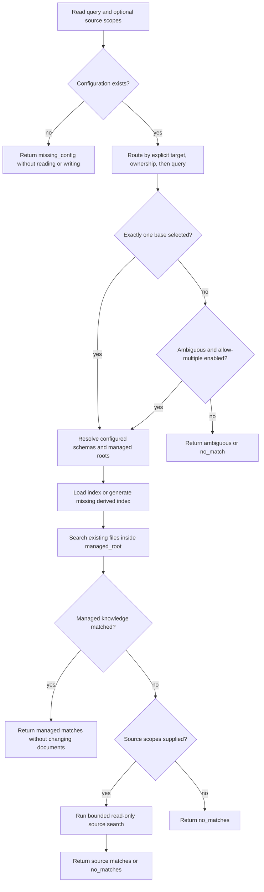
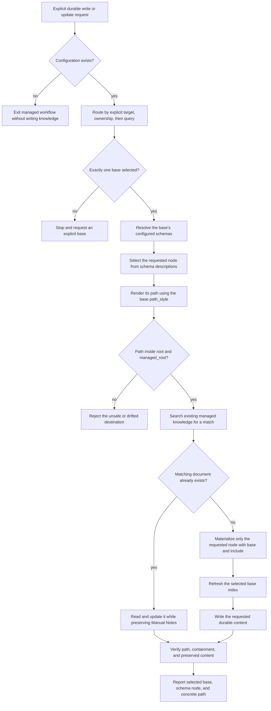

# mem

`mem` provides one interface for finding configuration, routing, reading, indexing, and safely materializing durable knowledge across configured filesystem bases.

It separates configuration discovery and migration, base routing, generated path-only indexes, bounded context lookup, and schema-backed file generation. Context lookup preserves knowledge documents and source files but can initialize a missing derived index. The skill workflow in [`SKILL.md`](./SKILL.md) owns the human-facing read/write rules; the scripts provide deterministic configuration, indexing, routing, lookup, and materialization primitives.

## Quickstart

Install the `mem` command before use. Python 3 with PyYAML is required; schema commands also require [`uv`](https://docs.astral.sh/uv/). Set `MEM_SKILL_ROOT` to the directory containing this skill's `SKILL.md`, then run:

```bash
if ! command -v mem >/dev/null 2>&1; then
  python3 "$MEM_SKILL_ROOT/scripts/install.py" || exit 1
  export PATH="$HOME/.local/bin:$PATH"
fi
mem --help
```

Verify that help lists `mem config find`, `mem config show`, `mem context lookup`, and `mem schema`. If a different command is found, resolve the `PATH` conflict before running memory operations.

The installer places a launcher in `~/.local/bin`. It preserves the caller's working directory so commands find the project's `.mem.yaml`. Run the following commands from your project directory; see [installation and recovery](./CLI.md#installation) for details.

```bash
# Find configuration first; stop the managed workflow if status is missing_config.
mem config find --pretty

# For existing version-1 configuration, upgrade after installing the updated skill.
mem doctor --migrate --pretty

# Inspect the normalized configuration.
mem config show --pretty

# Explain which base owns a request.
mem route \
  --query "document the claw gateway" \
  --source /Users/kevinlin/code/openclaw \
  --pretty

# Inspect a schema without writing files.
mem schema describe pkg

# Proactively build, inspect, and verify generated base indexes.
mem index build --base example --pretty
mem index show --base example --pretty
mem index check --all --pretty
```

See [`CLI.md`](./CLI.md) for the complete command reference.

## Config

Use `mem config find --pretty` to locate configuration through the CLI. It returns `status: found` with ordered `config_paths`, or `status: missing_config` with an empty list; both exit successfully. Discovery does not parse YAML, validate configured resources, or write configuration or memory artifacts. Use `mem config show` next to load and validate the discovered configuration. See [`config find`](./CLI.md#config-find) for options and explicit-file errors.

`mem` reads YAML configuration from the nearest `.mem.yaml` at or above the current directory and from `$HOME/.mem.yaml`. Both files are merged; the nearest file wins when they define the same base name. `--config PATH` loads only the specified file.

Named schemas are discovered from the nearest ancestor `schemas/<name>/schema.yaml`, then `$HOME/.schemas/<name>/schema.yaml`, and finally the skill's bundled schemas. This lets a project keep `.mem.yaml` and its schemas together without machine-specific absolute paths.

```yaml
version: 2
audit:
  enabled: false
  trace_root: ~/.config/mem/traces
bases:
  - name: example
    description: Engineering knowledge for the example workspace.
    root: /absolute/path/to/workspace
    managed_root: notes
    path_style: directory
    aliases:
      - example/main
    priority: 10
    skill: example-skill
    schemas:
      - name: pkg
        root: packages
      - name: specs
    match:
      source_globs:
        - /absolute/path/to/workspace
        - /absolute/path/to/workspace/**
      cwd_globs:
        - /absolute/path/to/workspace
        - /absolute/path/to/workspace/**
  - name: project-family
    description: Knowledge for the current matching project.
    root_pattern: proj*
    schemas:
      - name: pkg
        root: .
  - name: agent-projects
    description: Package and project knowledge for the current project.
    root_pattern: /absolute/path/to/agents/projects/*
    path_style: directory
    schemas:
      - name: pkg
      - name: project
      - name: specs
```

### Top-level fields

- `version`: required configuration format version. The only supported current value is the integer `2`; migrate existing version-1 files explicitly with `doctor --migrate`.
- `bases`: required nonempty list of configured knowledge bases. Each item describes one filesystem boundary, set of schemas, and optional routing signals.
- `audit`: optional lookup-tracing mapping. `enabled` defaults to `false`; `trace_root` defaults to `$HOME/.config/mem/traces`. The nearest config that declares `audit` owns the complete effective mapping, while omitted fields receive defaults.

### Required base fields

- `name`: unique nonempty base identifier, such as `dendron`, `oai`, or `claw`. Use this value with `--target` and `--base`. Names and aliases must not collide after configurations are merged.
- `description`: nonempty plain-language explanation of the base's contents. The router uses its words and phrases as query-routing signals.
- Exactly one of `root` or `root_pattern`:
  - `root`: fixed workspace ownership and containment boundary. Absolute paths, `~`, environment variables, and paths relative to the configuration file are supported.
  - `root_pattern`: basename glob such as `proj*`, or absolute path glob such as `/workspace/projects/*`, matched against the resolved session directory and its ancestors. Path patterns match one component at a time: `*` does not cross `/`, so `/workspace/projects/first/src` resolves to `/workspace/projects/first`. `~` and environment variables are expanded. Relative path patterns, traversal, backslashes, and recursive `**` path components are rejected. The nearest matching ancestor becomes the concrete root; unmatched bases are inactive and cannot be selected explicitly. Fixed-root ownership takes precedence over pattern-root ownership; competing pattern owners remain ambiguous. A project resolves to one root.
  The resolved root must be an existing directory unless `--allow-missing-roots` is explicitly supported and supplied.
- `schemas`: nonempty list of schema mappings available to the base. Managed materialization accepts only schemas listed here.

### Optional base fields

- `managed_root`: knowledge read/write directory relative to `root`; defaults to `root`. It cannot be absolute, contain `..`, or resolve outside the workspace root. For example, `root: /Users/kevinlin/dendron` with `managed_root: notes` owns the Dendron workspace but constrains managed knowledge to `/Users/kevinlin/dendron/notes`.
- `path_style`: filesystem layout, either `directory` or `dotted`. `directory` renders a node such as `pkg/example/cook/setup.md`; `dotted` renders `pkg.example.cook.setup.md`. If omitted, `mem` infers the prevailing style from Markdown files beneath the managed root and falls back to `directory` when no style predominates.
- `aliases`: list of additional nonempty labels accepted by `--target` and `--base`. Aliases must be unique and cannot collide with another base name or alias. An alias changes only the label; it cannot change the root, managed root, or schema-relative destination.
- `priority`: integer used to order candidates and break tied query scores; defaults to `0`. A higher value cannot override explicit selection, resolve conflicting filesystem ownership, or replace the query-confidence requirement.
- `skill`: nonempty name of an associated domain skill. It is preserved as base metadata for callers that need the corresponding workflow.
- `match`: optional filesystem-ownership mapping. When present, it must include at least one supported ownership field described below.

Normalized bases also expose the derived `index_path`, always `<managed_root>/.mem.index.json`. Configuration cannot override this location.

### Schema fields

Each item in `schemas` is a mapping with these fields:

- `name`: required nonempty schema name. Without `path`, it resolves to the bundled schema at `./references/schemas/<name>/schema.yaml`.
- `path`: optional absolute path to a custom `schema.yaml`. `~` and environment variables are expanded, but relative paths are rejected. The file must already exist, even when `--allow-missing-roots` is used.
- `root`: optional relative hierarchy mount within the base's managed root. Use `packages` or a nested value such as `projects/packages` to prefix the schema's nodes; use `.` to mount them inline with no extra root node. Absolute paths and parent traversal are rejected. An omitted root keeps existing behavior: `pkg` mounts at `pkg`, while schemas that were already inline remain inline.

For example:

```yaml
schemas:
  - name: pkg
    root: packages
  - name: specs
    root: .
  - name: custom
    path: /absolute/path/to/custom/schema.yaml
    root: projects/packages
```

For package `example`, `root: packages` produces `packages/example/...`, `root: .` produces `example/...`, and an omitted `pkg` root preserves `pkg/example/...`. No additional fields are accepted in a schema mapping.

### Match fields

Each field under `match` is a list of unique, nonempty strings:

- `source_globs`: filesystem glob patterns matched against each `--source` value. A matching pattern places the base in the ownership tier. Include both the directory itself and a `/**` pattern when both must match.
- `cwd_globs`: filesystem glob patterns matched against the resolved working directory. A matching pattern also places the base in the ownership tier. The working directory additionally matches ownership when it equals the base `root` or `managed_root`, or is nested beneath the resolved base root.

`source_globs` and `cwd_globs` establish ownership; generated index metadata supplies topic and artifact-kind query signals. The retired `topics` and `artifact_kinds` configuration fields and all other unsupported `match` fields are rejected. Fixed-root owners take precedence over pattern-root owners; multiple owners at the same precedence remain `ambiguous` even when one base has a higher `priority`.

Inspect the effective, normalized configuration with:

```bash
mem config show --pretty
```

### Migrating existing configuration

After installing the updated skill, run:

```bash
mem doctor --migrate --pretty

# Migrate only an explicitly selected configuration file.
mem doctor --migrate --config /tmp/example.mem.yaml --pretty
```

The migration discovers the same ordered project and home configuration files as ordinary commands. It changes each existing top-level `version: 1` to `version: 2`, discards retired `match.topics` and `match.artifact_kinds`, and retains `cwd_globs`, `source_globs`, roots, schemas, aliases, priority, auditing, and all other supported settings. If removing retired fields leaves no ownership globs, the entire empty `match` mapping is removed. Existing valid version-2 files are not rewritten.

Every transformed file and the merged result are validated before writes begin. Changed files retain their permissions and are replaced atomically, one file at a time. A later replacement can fail after an earlier one succeeds; rerunning the idempotent migration safely finishes remaining files. Migration does not build indexes or leave backups or durable lockfiles. Ordinary commands reject legacy version-1 files until migration succeeds.

## Design

### Bases define ownership and managed knowledge

A `.mem.yaml` base has two filesystem boundaries:

- `root`: the workspace a base owns for routing and containment, configured directly or resolved from `root_pattern` for the current session.
- `managed_root`: the subtree where managed knowledge may be read or written. It is relative to `root` and defaults to `root`.

This distinction lets a workspace own source and configuration outside its knowledge directory. For example, a Dendron base can own the workspace root while restricting managed operations to `notes/`.

Each base also declares its schemas and can declare schema-specific root mounts, `path_style`, aliases, priority, a related skill, and deterministic ownership globs. See [Config](#config) for every supported field, default, and validation rule.

### Generated indexes summarize paths, not document contents

Every configured base owns one disposable cache at `<managed_root>/.mem.index.json`. Its file-format `version: 1` is independent of configuration `version: 2`. The index stores the base's `path_style`, generation timestamp, deterministic relative-path fingerprint, eligible document count, generated topic and artifact-kind metadata, and the first two logical hierarchy levels with descendant document counts:

```json
{
  "version": 1,
  "generated_at": "2026-08-08T13:26:00-07:00",
  "path_style": "directory",
  "source_fingerprint": "sha256:...",
  "document_count": 14,
  "metadata": {
    "topics": ["clawcmd", "pkg"],
    "artifact_kinds": ["reference", "spec"]
  },
  "hierarchy": [
    {
      "path": "pkg",
      "document_count": 12,
      "children": [{"path": "pkg/clawcmd", "document_count": 12}]
    },
    {"path": "ref", "document_count": 1, "children": []},
    {"path": "specs", "document_count": 1, "children": []}
  ]
}
```

Directory-style `pkg/clawcmd/ref/auth.md` and dotted `pkg.clawcmd.ref.auth.md` have equivalent first-level `pkg` and second-level `clawcmd` nodes. Deeper components contribute to descendant counts but are not enumerated. Artifact-shaped labels are classified before topics: `cook`/`cookbook` become `cookbook` and `guide`; `ref` becomes `reference`; and labels such as `specs`, `reports`, `runbooks`, `research`, `decisions`, `findings`, and `lessons` contribute their normalized artifact kinds. Remaining meaningful labels become sorted, deduplicated topics; numeric-only and generic labels are discarded.

The scanner examines every eligible non-symlink Markdown path under `managed_root`, with the same hidden/generated-directory exclusions as managed search but **no file-count or directory-count cap**. It never reads document bodies or stores headings, frontmatter, credentials, or absolute machine-local paths. Body-only edits therefore do not stale the index. Unchanged fingerprints preserve both the file bytes and `generated_at`.

Cooperating processes lock the existing managed-root directory with an operating-system advisory lock and atomically replace the index when it changes. No `.lock` file or second durable knowledge-base artifact is created. The cache may be synchronized or committed with its knowledge base, but managed Markdown files remain authoritative.

#### How the existing index is generated

1. Find every eligible Markdown document under the base's `managed_root`.
2. Convert each relative path into logical hierarchy components using the
   base's `directory` or `dotted` path style.
3. Keep the first two components, count descendant documents, and derive
   normalized topic names and recognized artifact kinds from those components.
4. Fingerprint the complete document-path set and atomically write
   `<managed_root>/.mem.index.json` when its contents change.

Indexes are generated automatically when routing or context lookup first uses
a base, refreshed after managed document creation, or built explicitly with
`mem index build --base NAME`.

#### What the existing index contains

The current index records hierarchy nodes, not semantic entity objects. For
example, an engineering base can contain:

```text
packages
  packages/apitool
  packages/arcade
pkg
  pkg/clawcmd
  pkg/clawgateway
projects
  projects/2026.03-ga-launch
```

These package and project paths appear in `hierarchy`; their names can also
appear in generated `metadata.topics`. The current format has no `entities`
mapping, no entity kind classification, no custom aliases, and no
`alias_lookup`. Those capabilities belong to the proposed design below.

### Index lifecycle and explicit maintenance

Use these commands to manage one base or all configured bases:

```bash
mem index build --base example --pretty
mem index build --all --pretty
mem index show --base example --pretty
mem index check --base example --pretty
mem index check --all --pretty
```

`build` creates, updates, or leaves an unchanged index intact. `show` validates and displays the stored index without claiming freshness. `check` scans all eligible paths and reports `current`, `missing`, `stale`, `invalid`, or `error` without modifying files. `--base` accepts a configured name or alias; `--all` is available only to `build` and `check`. All commands accept `--config`, `--cwd`, and `--home`.

Routing and context lookup generate missing indexes automatically. Existing valid indexes are loaded without a freshness scan; malformed indexes require explicit `index build`. If automatic generation fails, routing still uses base names, aliases, and descriptions, and managed lookup still searches authoritative files; the selected base reports `build_failed`.

Successful managed schema materialization refreshes its base index automatically. If refresh fails, the created document, original stdout, and successful exit status remain intact; stderr receives exactly one machine-readable warning with `level`, `code: index_refresh_failed`, `base`, `index_path`, the actual `error`, and `repair_argv`. Replay `repair_argv` as an argument array; it preserves the original entrypoint and any explicitly supplied `--config`, `--cwd`, and `--home` options, including values containing spaces.

Agents that create a managed Markdown file directly instead of using managed materialization **must** run `mem index build --base NAME_OR_ALIAS` afterward. External editors, renames, deletions, and Git synchronization are not watched; run `index build` explicitly whenever their path changes need to be reflected. An explicit failed build remains an error rather than a successful-creation warning.

### Entity lookup design (proposed)

Packages and projects already exist in the knowledge hierarchy. A future entity
lookup can discover them from paths such as `pkg/clawcmd`, `packages/clawcmd`,
and `projects/claw-pilot`; dotted bases expose the same logical hierarchy.

Keep user-defined names in an optional `<managed_root>/.mem.aliases.yaml`:

```yaml
aliases:
  claw command: pkg/clawcmd
  cc: pkg/clawcmd
  claw pilot: projects/claw-pilot
```

Index generation combines discovered entities, aliases derived from their
names, and these explicit aliases into `.mem.index.json`:

```json
{
  "entities": {
    "pkg/clawcmd": {"kind": "package", "aliases": ["clawcmd", "claw command", "cc"]},
    "projects/claw-pilot": {"kind": "project", "aliases": ["claw pilot"]}
  },
  "alias_lookup": {
    "clawcmd": ["pkg/clawcmd"],
    "claw command": ["pkg/clawcmd"],
    "cc": ["pkg/clawcmd"],
    "claw pilot": ["projects/claw-pilot"]
  }
}
```

A conversation mentioning "claw command" resolves through `alias_lookup` to
`pkg/clawcmd`, then uses the existing base routing and context lookup. Multiple
matching entities remain ambiguous unless filesystem ownership or an explicit
base resolves them. The hierarchy owns entity existence, `.mem.aliases.yaml`
owns custom names, and the generated index owns fast lookup. Future fingerprint
calculation must include alias-file changes so rebuilding refreshes mappings.

Entity records, reverse alias lookup, and `.mem.aliases.yaml` are proposed;
they are not implemented by the current index.

### Routing uses strict precedence

The router evaluates exactly three tiers:

1. **Explicit:** `--target` matches a base name or alias.
2. **Ownership:** source or working-directory signals match a base.
3. **Query:** names, aliases, generated index topics and artifact kinds, descriptions, and priority rank the remaining candidates.

A lower tier never overrides a higher tier. Multiple ownership matches are ambiguous even if one candidate has a higher priority. Callers must provide `--target` when routing is ambiguous or has no match.

Aliases are labels, not path rewrites. An alias is safe only when it preserves the same root and behavior as its base; it cannot emulate a retired child-root base because it carries no root-relative prefix.

### Context lookup preserves documents and keeps search bounded

`context lookup` routes the request, resolves the selected base's schemas, and searches its managed root first. If managed knowledge has no match, it can search explicit `--source` paths as a fallback.

The lookup never materializes, edits, moves, or deletes knowledge documents or source files. Its sole permitted managed-root mutation is creation of a missing derived `.mem.index.json`; audit-enabled lookup additionally writes its separately configured audit trace. It skips symlinks, binary and oversized files, common generated directories, and hidden directories. Fixed file, directory, match, and source-scope limits keep knowledge and source searches bounded, even though index generation and freshness checks always scan all eligible document paths. The JSON result reports search counters, truncation, and the selected bases' index status and two-level hierarchies.

Schema descriptions guide the caller's inference about likely nodes. The lookup itself reports configured schemas and concrete matches; it does not claim that a model-inferred node is deterministic.

When `audit.enabled` is true, lookup also writes a fail-closed conversation trace. The active Codex conversation UUID must be present in `CODEX_THREAD_ID`; missing or unsafe identity, destination, locking, permission, serialization, or atomic-update state stops the lookup rather than running it unlogged.

#### Read query flow



### Audit traces

The first audited lookup for a conversation selects one file using the user's local date:

```text
<trace_root>/<YYYY>/<MM>/<DD>/<CODEX_THREAD_ID>.jsonl
```

Later lookups reuse that file even after local midnight. Trace directories use mode `0700`; files use mode `0600`. Each nonempty line is a complete JSON record for one distinct logical lookup.

A SHA-256 `lookup_id` fingerprints canonical identity inputs: session ID, query, ordered executed command arguments, selected bases, selected hierarchy paths, and source scopes. Repeating the same logical lookup updates its record atomically: `occurrence_count` increments, `attempts` gains a complete timing snapshot, and aggregate timing and latest outcome fields are refreshed. Concurrent same-conversation updates are serialized.

Records include exact command arguments, actual operation stages, timezone-aware timestamps, monotonic durations, routing and hierarchy decisions, fallback behavior, terminal status, and matched paths. They never include environment values, file bodies, credentials, unrelated commands, fabricated invocations, or private model reasoning. See [`CLI.md`](./CLI.md#audit-traces) for the full field contract and [`the feature specification`](../../docs/specs/active/2026-08-06-mem-audit-traces.md) for lifecycle and security details.

### Schemas describe placement and composition

Schemas under [`./references/schemas`](./references/schemas) define hierarchical paths, variables, templates, descriptions, insertion hints, and composition through `children_from`.

The principal aggregate layouts are:

- `code`: project-scoped code documentation at `packages/{{module}}`.
- `project`: project-root design, progress, learnings, steering, current flows, cookbooks, and reports.
- `specs`: numbered specifications with spec-local notes, flows, proofs, cookbooks, reports, and archives.
- `global-core`: workspace-wide `cook`, `ref`, and `t` namespaces.
- `pkg`: neutral package knowledge at `<schema-root>/{{package}}`, composed from `global-core`, `code-core`, and `specs`; the legacy default mount is `pkg`.

`pkg` mounts `global-core` first, so it owns overlapping `ref` and `t` nodes. `code-core` remains a reusable project-scoped component rather than becoming a workspace root. Composition passes variables only through explicit `vars` mappings.

Agent Project Directory bases select `project` and `specs` as sibling schemas.
They do not use `ag-dir` as a schema name or compatibility alias. The
project-root records are visible knowledge documents; spec-local notes archive
with their numbered spec directory.

The `description` field is the primary placement signal. `insertion_policy` breaks ties, and `dynamic_child` allows an explicitly requested child without authorizing callers to invent unrelated nodes.

### Materialization separates managed and unmanaged writes

Managed materialization requires `--base`. It derives the destination, path style, configured schema root mount, and optional custom schema path from the selected base. `--root-relative` can narrow the destination but must remain inside the resolved managed root.

Unmanaged materialization requires both `--out` and `--unmanaged`. It is intended for a caller-specified repository or temporary destination and never implies that the output belongs to a configured knowledge base.

Both modes materialize only schema nodes selected by full rendered `--include` paths. Existing files are protected by default: callers must choose `--skip-existing` or explicitly authorize `--overwrite`.

Managed materialization refreshes the selected base's derived index after successful execution. An unchanged path set leaves the index untouched; a failed refresh is a structured, repairable warning and never rolls back a successfully created document. Unmanaged materialization does not update any managed index.

#### Write query flow



## Components

```text
SKILL.md                         durable knowledge workflow and safety contract
CLI.md                           exhaustive CLI reference
./scripts/install.py               installs the mem launcher without changing caller scope
./scripts/mem.py                   unified command dispatcher and managed-write guardrails
./scripts/load_config.py           config discovery, migration, normalization, merge, and validation
./scripts/base_index.py            uncapped path indexing, hierarchy, locking, and atomic updates
./scripts/routing_signals.py       shared topic and artifact-kind normalization
./scripts/route.py                 precedence-tier routing and explanations
./scripts/context.py               bounded document-preserving managed/source search
./scripts/audit_trace.py           fail-closed conversation trace persistence
./scripts/schema.py                schema inspection, composition, and materialization
./references/knowledge-workflow.md read, write, update, and delete rules
./references/schema-workflow.md    schema model and authoring rules
./references/schemas/              bundled schemas and templates
./scripts/tests/                   CLI, configuration, routing, lookup, and schema tests
```

## Safety invariants

- Resolve managed paths against the selected base's managed root and keep them inside both `managed_root` and `root`.
- Treat routing ambiguity and no-match results as stopping conditions for managed writes.
- Search before creating a near-duplicate and materialize only the requested node.
- Refresh the derived base index after directly creating managed knowledge; report automatic refresh warnings without treating successful knowledge creation as failed.
- Preserve user-owned `## Manual Notes` content unless the user explicitly asks to edit it.
- Never delete knowledge without an explicit deletion request.
- Keep context lookup read-only for knowledge documents and source files, permitting only missing-index initialization; scope source fallback to caller-provided paths.
- When audit tracing is enabled, never continue after an audit identity, containment, permission, lock, serialization, or write failure.
- Require `--unmanaged` for every explicit output destination.

## Further reading

- [`CLI.md`](./CLI.md): every command, option, result, and recovery path.
- [`SKILL.md`](./SKILL.md): invocation rules and the managed knowledge workflow.
- [`./references/knowledge-workflow.md`](./references/knowledge-workflow.md): lookup and mutation contracts.
- [`./references/schema-workflow.md`](./references/schema-workflow.md): schema fields, composition, and authoring.
