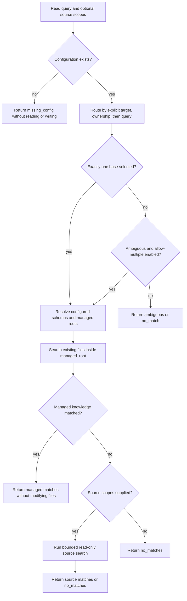
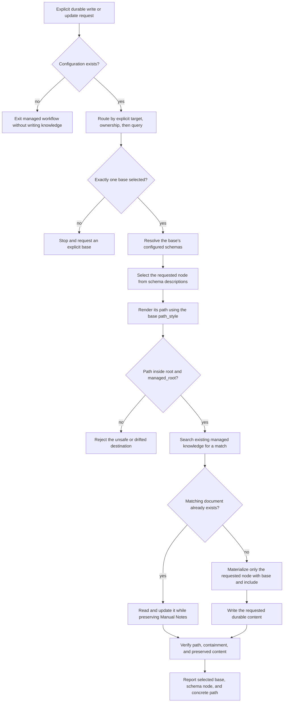

# mem

`mem` provides one interface for routing, reading, and safely materializing durable knowledge across configured filesystem bases.

It separates four concerns: configuration discovery, base routing, read-only context lookup, and schema-backed file generation. The skill workflow in [`SKILL.md`](./SKILL.md) owns the human-facing read/write rules; the scripts provide deterministic configuration, routing, lookup, and materialization primitives.

## Quickstart

Run commands from this directory. Python 3 is required, and schema commands also require [`uv`](https://docs.astral.sh/uv/) so the schema engine can load its declared dependencies.

```bash
# Inspect the normalized configuration.
python3 ./scripts/mem.py config show --pretty

# Explain which base owns a request.
python3 ./scripts/mem.py route \
  --query "document the claw gateway" \
  --source /Users/kevinlin/code/openclaw \
  --pretty

# Inspect a schema without writing files.
python3 ./scripts/mem.py schema describe pkg
```

See [`CLI.md`](./CLI.md) for the complete command reference.

## Config

`mem` reads YAML configuration from the nearest `.mem.yaml` at or above the current directory and from `$HOME/.mem.yaml`. Both files are merged; the nearest file wins when they define the same base name. `--config PATH` loads only the specified file.

Named schemas are discovered from the nearest ancestor `schemas/<name>/schema.yaml`, then `$HOME/.schemas/<name>/schema.yaml`, and finally the skill's bundled schemas. This lets a project keep `.mem.yaml` and its schemas together without machine-specific absolute paths.

```yaml
version: 1
bases:
  - name: example
    description: Engineering knowledge for the example workspace.
    root: /absolute/path/to/workspace
    managed_root: notes
    path_style: directory
    aliases:
      - example/main
    priority: 10
    skill: example-skill
    schemas:
      - name: pkg
      - name: specs
    match:
      topics:
        - example
        - deployment
      artifact_kinds:
        - guide
        - spec
      source_globs:
        - /absolute/path/to/workspace
        - /absolute/path/to/workspace/**
      cwd_globs:
        - /absolute/path/to/workspace
        - /absolute/path/to/workspace/**
```

### Top-level fields

- `version`: required configuration format version. The only supported value is the integer `1`.
- `bases`: required nonempty list of configured knowledge bases. Each item describes one filesystem boundary, set of schemas, and optional routing signals.

### Required base fields

- `name`: unique nonempty base identifier, such as `dendron`, `oai`, or `claw`. Use this value with `--target` and `--base`. Names and aliases must not collide after configurations are merged.
- `description`: nonempty plain-language explanation of the base's contents. The router uses its words and phrases as query-routing signals.
- `root`: workspace ownership and containment boundary. Absolute paths, `~`, environment variables, and paths relative to the configuration file are supported. The resolved path must be an existing directory unless `--allow-missing-roots` is explicitly supported and supplied.
- `schemas`: nonempty list of schema mappings available to the base. Managed materialization accepts only schemas listed here.

### Optional base fields

- `managed_root`: knowledge read/write directory relative to `root`; defaults to `root`. It cannot be absolute, contain `..`, or resolve outside the workspace root. For example, `root: /Users/kevinlin/dendron` with `managed_root: notes` owns the Dendron workspace but constrains managed knowledge to `/Users/kevinlin/dendron/notes`.
- `path_style`: filesystem layout, either `directory` or `dotted`. `directory` renders a node such as `pkg/example/cook/setup.md`; `dotted` renders `pkg.example.cook.setup.md`. If omitted, `mem` infers the prevailing style from Markdown files beneath the managed root and falls back to `directory` when no style predominates.
- `aliases`: list of additional nonempty labels accepted by `--target` and `--base`. Aliases must be unique and cannot collide with another base name or alias. An alias changes only the label; it cannot change the root, managed root, or schema-relative destination.
- `priority`: integer used to order candidates and break tied query scores; defaults to `0`. A higher value cannot override explicit selection, resolve conflicting filesystem ownership, or replace the query-confidence requirement.
- `skill`: nonempty name of an associated domain skill. It is preserved as base metadata for callers that need the corresponding workflow.
- `match`: mapping of optional routing signals. When present, it must include at least one supported field described below.

### Schema fields

Each item in `schemas` is a mapping with these fields:

- `name`: required nonempty schema name. Without `path`, it resolves to the bundled schema at `./references/schemas/<name>/schema.yaml`.
- `path`: optional absolute path to a custom `schema.yaml`. `~` and environment variables are expanded, but relative paths are rejected. The file must already exist, even when `--allow-missing-roots` is used.

For example:

```yaml
schemas:
  - name: pkg
  - name: custom
    path: /absolute/path/to/custom/schema.yaml
```

No additional fields are accepted in a schema mapping.

### Match fields

Each field under `match` is a list of unique, nonempty strings:

- `topics`: words or phrases that increase a base's query score when the request mentions them. Topics apply only after explicit selection and filesystem ownership fail to choose a base.
- `artifact_kinds`: artifact labels, such as `guide`, `runbook`, or `spec`, that increase the query score when they match `--artifact-kind` or an artifact kind inferred from the request.
- `source_globs`: filesystem glob patterns matched against each `--source` value. A matching pattern places the base in the ownership tier. Include both the directory itself and a `/**` pattern when both must match.
- `cwd_globs`: filesystem glob patterns matched against the resolved working directory. A matching pattern also places the base in the ownership tier. The working directory additionally matches ownership when it exactly equals the base `root` or `managed_root`.

`source_globs` and `cwd_globs` establish ownership; `topics` and `artifact_kinds` influence query ranking only. Unsupported `match` fields are rejected. If multiple bases match ownership, routing returns `ambiguous` even when one base has a higher `priority`.

Inspect the effective, normalized configuration with:

```bash
python3 ./scripts/mem.py config show --pretty
```

## Design

### Bases define ownership and managed knowledge

A `.mem.yaml` base has two filesystem boundaries:

- `root`: the workspace a base owns for routing and containment.
- `managed_root`: the subtree where managed knowledge may be read or written. It is relative to `root` and defaults to `root`.

This distinction lets a workspace own source and configuration outside its knowledge directory. For example, a Dendron base can own the workspace root while restricting managed operations to `notes/`.

Each base also declares its schemas and can declare `path_style`, aliases, priority, a related skill, and deterministic match signals. See [Config](#config) for every supported field, default, and validation rule.

### Routing uses strict precedence

The router evaluates exactly three tiers:

1. **Explicit:** `--target` matches a base name or alias.
2. **Ownership:** source or working-directory signals match a base.
3. **Query:** names, aliases, topics, artifact kinds, descriptions, and priority rank the remaining candidates.

A lower tier never overrides a higher tier. Multiple ownership matches are ambiguous even if one candidate has a higher priority. Callers must provide `--target` when routing is ambiguous or has no match.

Aliases are labels, not path rewrites. An alias is safe only when it preserves the same root and behavior as its base; it cannot emulate a retired child-root base because it carries no root-relative prefix.

### Context lookup is bounded and read-only

`context lookup` routes the request, resolves the selected base's schemas, and searches its managed root first. If managed knowledge has no match, it can search explicit `--source` paths as a fallback.

The lookup does not create or edit files. It skips symlinks, binary and oversized files, common generated directories, and hidden directories. Fixed file, directory, match, and source-scope limits keep searches bounded; the JSON result reports counters and truncation.

Schema descriptions guide the caller's inference about likely nodes. The lookup itself reports configured schemas and concrete matches; it does not claim that a model-inferred node is deterministic.

#### Read query flow



### Schemas describe placement and composition

Schemas under [`./references/schemas`](./references/schemas) define hierarchical paths, variables, templates, descriptions, insertion hints, and composition through `children_from`.

The principal aggregate layouts are:

- `code`: project-scoped code documentation at `packages/{{module}}`.
- `specs`: workspace-wide numbered specifications, flows, proofs, cookbooks, and reports.
- `global-core`: workspace-wide `cook`, `ref`, and `t` namespaces.
- `pkg`: neutral package knowledge at `pkg/{{package}}`, composed from `global-core`, `code-core`, and `specs`.

`pkg` mounts `global-core` first, so it owns overlapping `ref` and `t` nodes. `code-core` remains a reusable project-scoped component rather than becoming a workspace root. Composition passes variables only through explicit `vars` mappings.

The `description` field is the primary placement signal. `insertion_policy` breaks ties, and `dynamic_child` allows an explicitly requested child without authorizing callers to invent unrelated nodes.

### Materialization separates managed and unmanaged writes

Managed materialization requires `--base`. It derives the destination, path style, and optional custom schema path from the selected base. `--root-relative` can narrow the destination but must remain inside the resolved managed root.

Unmanaged materialization requires both `--out` and `--unmanaged`. It is intended for a caller-specified repository or temporary destination and never implies that the output belongs to a configured knowledge base.

Both modes materialize only schema nodes selected by full rendered `--include` paths. Existing files are protected by default: callers must choose `--skip-existing` or explicitly authorize `--overwrite`.

#### Write query flow



## Components

```text
SKILL.md                         durable knowledge workflow and safety contract
CLI.md                           exhaustive CLI reference
./scripts/mem.py                   unified command dispatcher and managed-write guardrails
./scripts/load_config.py           config discovery, normalization, merge, and validation
./scripts/route.py                 precedence-tier routing and explanations
./scripts/context.py               bounded read-only managed/source search
./scripts/schema.py                schema inspection, composition, and materialization
./references/knowledge-workflow.md read, write, update, and delete rules
./references/schema-workflow.md    schema model and authoring rules
./references/schemas/              bundled schemas and templates
./scripts/tests/                   CLI, configuration, routing, lookup, and schema tests
```

## Safety invariants

- Resolve managed paths against the selected base's managed root and keep them inside both `managed_root` and `root`.
- Treat routing ambiguity and no-match results as stopping conditions for managed writes.
- Search before creating a near-duplicate and materialize only the requested node.
- Preserve user-owned `## Manual Notes` content unless the user explicitly asks to edit it.
- Never delete knowledge without an explicit deletion request.
- Keep context lookup read-only and source fallback scoped to caller-provided paths.
- Require `--unmanaged` for every explicit output destination.

## Further reading

- [`CLI.md`](./CLI.md): every command, option, result, and recovery path.
- [`SKILL.md`](./SKILL.md): invocation rules and the managed knowledge workflow.
- [`./references/knowledge-workflow.md`](./references/knowledge-workflow.md): lookup and mutation contracts.
- [`./references/schema-workflow.md`](./references/schema-workflow.md): schema fields, composition, and authoring.
