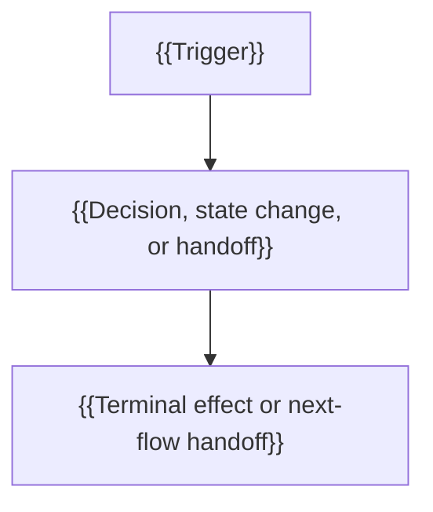

# {{behavior}} Flow

## Overview

{{What happens, what triggers it, why it matters, and where this flow stops.}}

## Entry Points

- Trigger: {{request, event, command, job, or user action}}
- Source: `path/to/file.ts:functionName`
- Assumptions: {{state, permissions, or context already present}}

## Flow

## Execution Trace

### 1. {{Meaningful runtime phase}}

`path/to/file.ts:functionName`

{{Describe what executes, what state changes or is frozen, who owns the next
boundary, and where control goes. Explain material branches at their decision
point. Add nested steps or a ts pseudocode block only when they clarify useful
complexity.}}

### 2. {{Terminal effect or next-flow handoff}}

`path/to/file.ts:functionName`

{{Describe the resulting state, observable effect, and recipient of the handoff.}}

## Debugging and Verification

- {{Relevant logs, metrics, commands, failure signatures, or observable outcomes}}
- {{How to verify the expected terminal effect or investigate a material failure}}

## Related docs

- {{Adjacent flow, architecture, design, or operational reference}}

## Manual Notes

[keep this for the user to add notes. do not change between edits]

## Changelog

- {{YYYY-MM-DD HH:MM}}: {{description of update}} ({{agent session id}} - {{git sha}})
